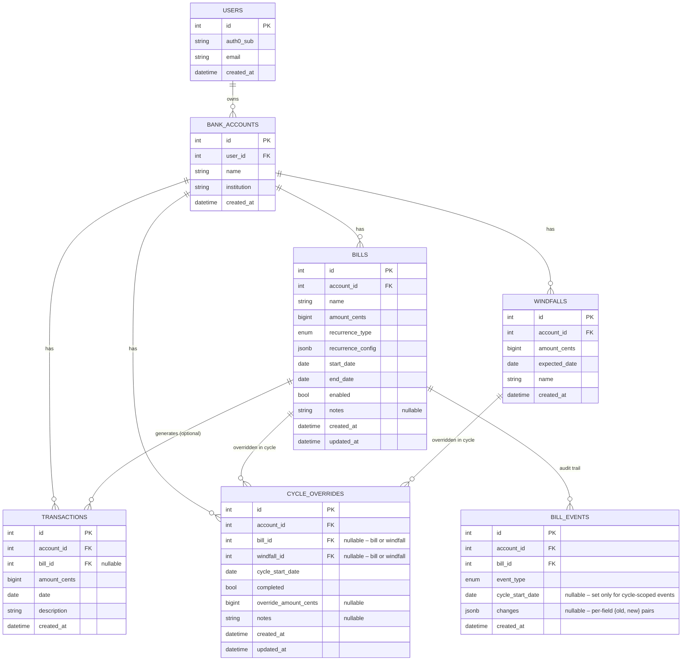

# Tally Roadmap

This is the living plan for building out Tally into a full bill-tracking and cash-flow
forecasting app. It's written to survive long gaps between sessions (~6 weeks apart,
~3 hours per session) — read this file first in any new session to see what's done and
what's next. Check off items as they land, and update the "Status" line at the top of
each phase.

This roadmap is now the planning source of truth. The original GitHub Project / bootstrap
issue set can be closed once each item is either reflected here, marked shipped, or called out
as superseded by the architecture decisions below.

## Vision

A multi-user bill-tracking and forecasting app, evolved from
[kenhowardpdx/bank](https://github.com/kenhowardpdx/bank) with:

1. Real authentication (Auth0)
2. Multiple bank accounts per user
3. Postgres (Neon) instead of local storage
4. A better UI, built in Svelte instead of React
5. Enable/disable control on individual bills
6. Finer-grained due-date interval control than "day of month" or "annual"
7. Ability to add one-off transactions within the current cycle
8. Ability to forecast a future windfall (bonus, tax refund, etc.)
9. Human-readable CSV import/export of all bills for a bank account, editable in Excel
   or Numbers, with amounts formatted in the selected display currency (default
   USD)
10. Notes support on bills and per-cycle override snapshots (for reconciliation context)
11. A bill history view showing forecasted vs actual outcomes across prior cycles

## What to reuse from `kenhowardpdx/bank`

The reference repo (cloned for research, not vendored) has real substance worth
porting rather than re-deriving from scratch:

- **`packages/forecast`** — a mature, tested cycle/due-date engine (`Bill`, `Cycle`,
  `Amount`, `getForecast`). Supports bi-weekly, monthly, semi-monthly ("10th & 25th"),
  and annual bills; computes which bills fall in a pay cycle and a running balance.
  Port the *logic*, not the code as-is — see Architecture Decisions below for the two
  changes to make while porting.
- **`apps/clientv0`** — the older, local-storage React UI (`Bills.tsx`, `Forecast.tsx`,
  `BillRow.tsx`). Not the codebase to reuse, but the *UX* is proven: an editable bill
  table, and a forecast table of pay-cycle rows (date range → running total, expandable
  to show which bills hit that cycle). Good starting point for the Svelte equivalent.
- **`apps/server` + `apps/client`** — a newer, partially-migrated Postgres + Auth0
  version. The migration to this architecture was never finished (bills CRUD/forecast
  UI never got ported over), but `AuthProvider.tsx` shows the working Auth0 SPA
  integration pattern, and `init.sql` shows a first-pass schema — both reference points
  for Tally's equivalents, not something to copy directly (Tally's schema goes further
  per the data model below).

## Architecture decisions

- **Data layer**: SQLAlchemy (async, via `asyncpg`) + Alembic migrations. More setup
  than raw SQL, but the schema lives in Python and migrations autogenerate — worth it
  across 6-week gaps where re-deriving the schema from scratch `.sql` files would cost
  real time.
- **Money**: integer cents (`amount_cents`, `BigInteger`) in Postgres, `Decimal` in
  Python — never float. The reference app's `Amount` class uses `parseFloat` on
  currency strings, a real precision bug worth not repeating. For UI and CSV
  import/export, format and parse amounts using the selected display currency
  (default USD) while persisting normalized cents.
- **Recurrence model**: an extended enum (`weekly`, `biweekly`, `semimonthly`,
  `monthly`, `annually`, `custom_days`) plus a small JSONB `recurrence_config` column
  for the type-specific bits (weekday, day-of-month, interval-in-days, etc.). Covers
  real-world bills without taking on full iCal RRULE complexity.
- **Auth**: Auth0. Backend validates JWTs via a FastAPI dependency (JWKS-based
  signature check, no session state). Frontend uses Auth0's SPA pattern (same shape as
  the reference app's `AuthProvider.tsx`, adapted for SvelteKit).
- **Local dev**: docker-compose Postgres for local development; Neon for prod (already
  provisioned — `TF_VAR_neon_org_id`/`NEON_API_KEY` exist in `.secrets`, but the actual
  database/schema isn't Terraform-managed yet, just manually created. Formalizing that
  is a Phase 0 task, not required before it).

## Data model

Implemented in `backend/src/models/` (SQLAlchemy 2.0, `Mapped`/`mapped_column` style) and
codified in the Alembic migration at `backend/alembic/versions/9f979f5fb842_initial_schema.py`.

Maps directly to the differences above: `users.auth0_sub` → auth; `bank_accounts` → multi-account;
whole schema → Postgres; `bills.enabled` → enable/disable; `recurrence_type`/`recurrence_config`
→ finer intervals; `transactions` → one-off entries; `windfalls` → future windfalls.
`cycle_overrides` → per-cycle reconciliation snapshots (see Phase 3, items 3.5–3.9).
`bills.notes`/`cycle_overrides.notes` → optional user-entered context for recurring entries and
cycle-specific adjustments.

### Cycle overrides design note

`CYCLE_OVERRIDES` is a **per-(account, bill-or-windfall, cycle_start_date)** snapshot row,
created on demand the first time a user interacts with a bill or windfall inside an active
cycle. Exactly one of `bill_id` / `windfall_id` is set (the other is NULL). Three independent
concerns live in the same row:

- **`completed`** — the user has confirmed the payment was made (bill) or deposit was received
  (windfall). Replaces the old "prepend an `x` to the name" workaround from the `bank`
  prototype; flipping this flag does not rename the bill or affect any other cycle.
- **`override_amount_cents`** — the *actual* amount for this single occurrence (electricity
  rebate, seasonal water bill, etc.). `NULL` means "use the bill's or windfall's base
  `amount_cents` as normal." Setting it replaces the forecasted amount in the running balance
  for this cycle only; the underlying bill's or windfall's `amount_cents` is unchanged for
  all future cycles.
- **`notes`** — optional cycle-specific context (why an amount changed, confirmation details,
  reimbursement timing, etc.) without editing the canonical bill or windfall definitions.

`recurrence_type` is a Postgres enum (`weekly`, `biweekly`, `semimonthly`, `monthly`, `annually`,
`custom_days`); `recurrence_config` holds the type-specific shape (e.g. `{"day_of_month": 15}`,
`{"days": [10, 25]}` for semimonthly, `{"interval_days": 45}` for custom_days) — validated by the
forecast engine in Phase 2, not by a DB constraint.

### Neon: manual vs. Terraform-managed (Phase 0.2 decision)

**Decision: keep the Neon project/database manual for now.** The connection strings already flow
into the Lambda's environment via `TF_VAR_database_url_readwrite`/`readonly` (see
`infra/variables.tf`), and Alembic now owns schema evolution independently of Terraform — so
bringing Neon itself under the Terraform Neon provider would manage project/branch creation but
wouldn't simplify anything currently painful. Revisit if/when multiple environments (e.g. a
per-PR preview branch) make manual Neon console clicks a recurring chore.

---

## Phase 0 — Foundations

**Status**: code complete

- [x] 0.1 Finalize data model (turn the sketch above into real SQLAlchemy models + an ER
      diagram in this doc)
- [x] 0.2 Alembic setup + initial migration creating all tables; formalize the Neon
      database connection (confirm whether to bring it under Terraform via the Neon
      provider, or keep it manual — decide and document here)
- [x] 0.3 Local dev: docker-compose Postgres for backend dev, `.env` pattern mirroring
      prod's Neon connection shape
- [x] 0.4 Backend JWT validation dependency (`get_current_user`, `backend/src/core/auth.py`)
      + protected test endpoint (`GET /api/v1/me`), tested against a locally-signed RSA
      token so it doesn't depend on a real tenant existing yet. Auth0 tenant + API created;
      `AUTH0_DOMAIN`/`AUTH0_AUDIENCE` filled in `backend/.env` (see `backend/.env.example`).
- [x] 0.5 Auth0 frontend integration in SvelteKit (`frontend/src/lib/auth.ts`):
      login/logout, protected route pattern (`frontend/src/routes/(app)/+layout.svelte`),
      token attached to API calls (`frontend/src/lib/api.ts`). `PUBLIC_AUTH0_DOMAIN`/
      `PUBLIC_AUTH0_CLIENT_ID`/`PUBLIC_AUTH0_AUDIENCE` filled in `frontend/.env` (see
      `frontend/.env.example`), and the dev URL (`http://localhost:5173`) added as an
      Allowed Callback/Logout/Web Origin URL in the Auth0 SPA application settings.
- [x] 0.6 Local dev auth bypass: `DEV_AUTH_BYPASS`/`PUBLIC_DEV_AUTH_BYPASS` env vars (off by
      default, never set in a deployed environment - nothing in `infra/` sets them). Backend
      short-circuits `get_current_user` (`backend/src/core/auth.py`) before touching
      JWKS/jose at all; frontend short-circuits `initAuth`/`login`/`logout`/`getAccessToken`
      (`frontend/src/lib/auth.ts`). Dummy identity: `auth0|charlie_kelly_dev` /
      `charlie.kelly@paddys.bar`, JIT-provisioned through the normal
      `get_current_db_user` path with no special-casing needed.

## Phase 1 — Accounts & Bills CRUD

**Status**: code complete

- [x] 1.1 Backend: `bank_accounts` CRUD API, scoped to the authenticated user
- [x] 1.2 Backend: `bills` CRUD API, scoped to an account, including the enable/disable
      toggle
- [x] 1.3 Frontend: accounts list/management page
- [x] 1.4 Frontend: bills list/management page per account (Svelte equivalent of
      `clientv0`'s `Bills.tsx` editable table UX)
- [x] 1.5 Bills page header always reads "Bills" regardless of which account you're on —
      should read `Bills (<Name> - <Bank>)`. Backend already exposes
      `GET /api/v1/accounts/{id}`; frontend just needs a `getAccount` call added to
      `frontend/src/lib/api/accounts.ts` and used in
      `frontend/src/routes/(app)/accounts/[id]/+page.svelte`.
- [x] 1.6 Move a bill to a different bank account. Backend: extend `BillUpdate`/
      `PATCH .../bills/{id}` (`backend/src/schemas/bill.py`, `backend/src/api/bills.py`) to
      accept a target `account_id`, verifying the target account also belongs to the
      current user (same ownership check pattern as `get_owned_bank_account`). Frontend: an
      pop-up modal where the user can select an account to move the bill to; once applied
      the bills list is updated to show the current list of bills sans the bill that was
      moved.
- [x] 1.7 Recurrence-specific config UI for the bill form, on both create and a new bill
      edit modal (none existed before - the roadmap's "on both create and edit" phrasing
      meant building one). New shared `RecurrenceConfigFields.svelte` renders per-type
      fields (nothing for weekly/biweekly/monthly/annually; two 1-31 day inputs defaulting
      to `[10, 25]` for semimonthly; one interval input defaulting to 30 for custom_days)
      and both the create form and edit modal now actually send `recurrence_config`
      (previously always omitted). Also rebuilt `Select.svelte` as a custom Tailwind
      popover listbox (mirroring `DatePicker.svelte`'s pattern) instead of a native
      `<select>`, since this item needed more per-type fields on top of it.
- [x] 1.8 Bills CSV import/export per bank account. Backend: `GET/POST
      .../bills/{export,import}` (`backend/src/bills_csv.py`, `backend/src/api/bills.py`) -
      dollars not cents, `semimonthly_days`/`custom_interval_days` as their own columns
      instead of raw JSON, all-or-nothing import validation (a 422 with a per-row error
      list if any row fails, nothing inserted). Frontend: Import/Export buttons on the
      bills page (`frontend/src/lib/api/bills.ts`'s `exportBillsCsv`/`importBillsCsv`, via
      `apiFetch` directly rather than `apiJson` since a CSV blob/multipart upload isn't
      JSON).
- [x] 1.9 Bill notes support. `Bill.notes` (nullable, migration `12aa348bb14f`), threaded
      through `BillCreate`/`Update`/`Read` and the create form + edit modal (no dedicated
      bills-table column, to avoid clutter - the edit modal is the "detail affordance").

## Phase 2 — Forecast Engine

**Status**: code complete

- [x] 2.1 Port `Bill`/`Cycle`/`getForecast` to Python (`backend/src/forecast/`); no
      `Amount`/`Decimal` needed - `Bill.amount_cents` is already exact integer cents, so
      the whole engine is plain int arithmetic. Ported the bi-weekly/monthly golden-value
      test cases from `packages/forecast/src/__tests__/{cycle,forecast}.test.ts` directly
      (exact cents-converted parity); the semimonthly ("10th & 25th") cases were **not**
      ported as-is - the reference's day-bucket boundary for snapping onto the 10th/25th
      anchor is itself part of the `start`/`next` aliasing bug this port fixes rather than
      reproduces (day 21 snapped to the 25th in the reference, skipping the still-active
      10th-24th period), so those pin this engine's own corrected, self-verified output
      instead. See `backend/tests/test_forecast_engine.py`'s module docstring.
- [x] 2.2 Extended for weekly/semimonthly/custom_days per-bill recurrence (`RecurrenceType`,
      already modeled in Phase 1), plus a `weekly` *cycle* type the reference left as
      `throw new Error("NOT IMPLEMENTED")`. Also generalized beyond the reference's
      single-occurrence-per-cycle model: a weekly-recurring bill inside a monthly forecast
      cycle can genuinely recur more than once in that window, and now all occurrences
      count (see `test_weekly_bill_recurs_multiple_times_within_a_monthly_cycle`).
      Bills needing `recurrence_config` data that doesn't exist yet (semimonthly,
      custom_days - 1.7 was deferred) are skipped with a reason rather than guessed at or
      failing the whole request (`ForecastResponse.unscheduled_bills`).
- [x] 2.3 `POST /api/v1/accounts/{id}/forecast` (`backend/src/api/forecast.py`) - only
      `enabled` bills, scoped via the existing `get_owned_bank_account` pattern. Also
      persists the request's five params onto the account (`BankAccount.forecast_*`
      columns, new migration) as a side effect, so `GET .../accounts/{id}` returns the
      last-used settings - added after a plan review caught that the reference's
      client persisted these to `localforage` for exactly this reason (pay cycles are
      ~2 weeks apart; don't make the user re-enter the starting balance every visit).
- [x] 2.4 `frontend/src/routes/(app)/accounts/[id]/forecast/+page.svelte` - a separate
      route rather than the reference's same-page tab (fits SvelteKit's routing model
      better, keeps the bills page from growing further); form prefilled from the
      account's saved settings, explicit "Calculate" submit (a real API round-trip now,
      not the reference's free client-side recompute-on-keystroke); cycle rows expand
      in place to show bill line items, with the reference's red/gray
      negative/low-balance row coloring ported to Tailwind classes.

## Phase 3 — Transactions, Windfalls & Cycle Reconciliation

**Status**: code complete

- [x] 3.1 Backend: one-off `transactions` CRUD (`backend/src/api/transactions.py`),
      folded into the forecast calculation alongside recurring bills
      (`backend/src/forecast/`). `Transaction.amount_cents` is **signed** (positive
      credits, negative debits) — unlike `Bill` (always a positive expense) or
      `Windfall` (always positive income), a one-off transaction is general-purpose.
      `Cycle`/`get_forecast` gained a combined `net_cents` per cycle
      (`transactions_total + windfalls_total - bills_total`); the tables already existed
      from Phase 0's initial migration, so no new migration was needed.
- [x] 3.2 Frontend: `/accounts/[id]/transactions` — list/create/delete, matching the
      bills page's original (pre-1.5/1.6) depth.
- [x] 3.3 Backend: `windfalls` CRUD (`backend/src/api/windfalls.py`), folded into
      forecast the same way — always a positive credit.
- [x] 3.4 Frontend: `/accounts/[id]/windfalls` entry UI; the forecast page's expanded
      cycle rows now also list transaction and windfall line items alongside bills,
      windfalls visually distinguished with a badge (the one thing in a forecast that's
      unambiguously good news). Added a shared `AccountNav` component
      (`frontend/src/lib/components/AccountNav.svelte`) across all four per-account pages
      (Bills/Transactions/Windfalls/Forecast) — the old one-off "← Accounts"/"Forecast →"
      links didn't scale past two sibling pages.
- [x] 3.5 Data model + migration: `cycle_overrides` table (`backend/src/models/cycle_override.py`,
      migration `f7442af7b00b`) — one row per (account, bill-or-windfall, cycle_start_date), with a
      `completed` bool and a nullable `override_amount_cents`, plus optional `notes` text. DB
      uniqueness via `(account_id, bill_id, cycle_start_date)` and
      `(account_id, windfall_id, cycle_start_date)` unique constraints, plus a CHECK constraint that
      exactly one of `bill_id`/`windfall_id` is set (Postgres unique constraints treat NULLs as
      distinct, so only the non-null side of each row is actually constrained — the CHECK is what
      enforces "exactly one").
- [x] 3.6 Backend: `cycle_overrides` CRUD endpoints (`backend/src/api/cycle_overrides.py`) —
      `PUT /api/v1/cycle-overrides` (upsert by composite key, account resolved from the request body
      rather than a path param since there's no account-scoped prefix), `GET
      /api/v1/accounts/{id}/cycle-overrides?cycle_start={date}` (all overrides for a given cycle).
      Validates exactly one of `bill_id`/`windfall_id` is set (Pydantic model validator, mirroring the
      DB CHECK) and that the referenced entity belongs to the given account.
- [x] 3.7 Backend: Incorporated `cycle_overrides` into the forecast response
      (`backend/src/forecast/cycle.py`, `engine.py`) — for any bill or windfall with an override for
      the cycle's `start_date`: substitutes `override_amount_cents` into the running balance if set,
      annotates the line with `completed`/`notes`. Overrides are fetched in one query per forecast
      request and grouped by `cycle_start_date` before being handed to `build_cycle()` per cycle. A
      bill recurring more than once within a single cycle (e.g. weekly inside a monthly forecast)
      only applies its override to the first occurrence, matching the "one row per cycle" data model.
- [x] 3.8 Frontend: Active-cycle interactive controls in the forecast view
      (`frontend/src/routes/(app)/accounts/[id]/forecast/+page.svelte`). The active cycle
      (`start_date ≤ today < end_date`) renders a "Paid"/"Received" checkbox, an actual-amount field,
      and a note field per bill/windfall line, persisting via the 3.6 upsert endpoint on change.
      Every change re-runs the same forecast request (rather than patching cached cycles
      client-side) since an override can cascade into every later cycle's running balance and only
      the real engine computes that correctly. Completed items render muted/strikethrough; non-active
      cycles stay read-only display-only.
- [x] 3.9 Frontend: Reconciliation summary row at the bottom of the active cycle's expanded line
      items — forecasted total (bills'/windfalls' base amounts) vs. actual (the backend's
      override-substituted `net_cents`) vs. variance. Computed client-side from fields the forecast
      response already returns, no backend changes needed.
- [x] 3.10 Backend: bill-history endpoint (`GET .../bills/{bill_id}/history`, in
      `backend/src/api/bills.py`) returning cycle-by-cycle entries (cycle window, expected amount,
      actual overridden amount, completion, notes, variance), with `limit`/`offset` pagination and
      `start_date`/`end_date`/`cycle_type` filters. Reuses the forecast engine's cycle-boundary logic
      (promoted `_iter_cycle_bounds` to public `iter_cycle_bounds`, new
      `backend/src/forecast/bill_history.py`) so a cycle_overrides row lines up with the same cycle
      windows `/forecast` computes. Defaults to the account's persisted `forecast_start_date`/
      `forecast_cycle_type` (not the bill's own `start_date`) as the cycle anchor — overrides are
      keyed against whatever anchor `/forecast` actually used, so anchoring on the bill's own
      `start_date` instead would silently miss real overrides whenever the two dates disagree
      (caught via manual browser verification, not by the initial test suite — see session log).
- [x] 3.11 Frontend: bill history view
      (`frontend/src/routes/(app)/accounts/[id]/bills/[billId]/history/+page.svelte`, linked from a
      "History" action on the bills table). Renders a chronological table of each cycle's due date,
      cycle window, expected/actual amount, variance, paid state, and notes, with a simple
      offset-based "Load more" button rather than a full date-range picker UI.
- [x] 3.12 Bill event/audit log — 3.10/3.11's "bill history" only ever showed forecasted
      vs. actual per cycle (`cycle_overrides` state, not a change log). This adds a real
      append-only trail: bill created, bill fields updated (amount/name/recurrence/dates),
      notes changed, enabled/disabled — plus, per active cycle, marked paid/unpaid, the
      cycle's override amount changed, and cycle-specific notes applied. New `bill_events`
      table (`backend/src/models/bill_event.py`), written from `backend/src/api/bills.py`
      (create/update/import) and `backend/src/api/cycle_overrides.py` (upsert, diffed
      against the override's prior state), read via `GET .../bills/{bill_id}/events`. Scoped
      to bills only (not windfalls) — the ask was specifically about bill audit history.
      Frontend: an "Activity" timeline on the existing bill history page, alongside the
      cycle-by-cycle table.
- [x] 3.13 Bridge Cycle History and Activity instead of merging them - they're different
      shapes (one row per cycle occurrence showing current state, vs. one row per change
      including superseded intermediate ones) so a full merge would lose one or the other.
      Each Cycle History row now shows an "N changes" affordance when that cycle has
      activity, expanding inline to the same event/diff rendering the Activity tab uses,
      scoped to just that `cycle_start_date`. Backend: `cycle_start_date` filter added to
      `GET .../bills/{bill_id}/events`, plus a new `GET .../bills/{bill_id}/events/cycle-counts`
      (grouped counts per cycle, one request covers every visible row rather than querying
      per row) — both in `backend/src/api/bills.py`. No cycle-boundary computation needed
      for the counts endpoint since each cycle-scoped event already recorded the exact
      `cycle_start_date` its override used.

## Phase 4 — Multi-account dashboard & polish

**Status**: code complete

- [x] 4.1 Dashboard aggregating all of a user's accounts (combined + per-account views).
      Per account, a "current cycle" snapshot card: the pay cycle containing today (date
      range, bills due, running balance) at a glance, linking through to the full forecast
      page for that account. Reuses the forecast engine (`backend/src/forecast/`) rather
      than new logic - the open question is how to correctly identify "the cycle
      containing today" for cycle types that don't self-anchor (weekly/biweekly/monthly
      only snap to whatever `start_date` a request gives them, unlike semimonthly's fixed
      10th/25th boundaries - see `engine.py`'s `_cycle_bounds`), starting from the
      account's saved `forecast_start_date`/`forecast_cycle_type`
      (`BankAccount.forecast_*`, persisted since Phase 2.3) and stepping forward/backward
      to the cycle that actually contains today, rather than naively calling
      `get_forecast(start_date=today, end_date=today, ...)` (which would anchor a new
      cycle AT today instead of finding the in-progress one). Landed as
      `find_current_cycle_bounds` (`backend/src/forecast/engine.py`) - weekly/biweekly/
      monthly use a closed-form period estimate from the anchor plus a short correction
      loop; semimonthly ignores the anchor entirely and derives its fixed 10th/25th
      boundary straight from today's day-of-month, since it's self-anchoring. New
      `GET /api/v1/dashboard` (`backend/src/api/dashboard.py`) re-runs `get_forecast()` per
      account bounded to `[forecast_start_date, current-cycle-end]` and returns the last
      generated cycle plus a combined ending balance; accounts that have never had a
      forecast run report `configured: false` instead of guessing at settings. Frontend:
      `frontend/src/routes/(app)/dashboard/+page.svelte` replaces the dev-only placeholder
      with a combined-balance figure and per-account cards.
- [x] 4.2 UI/design pass — consistent Svelte component system, responsive layout. Done:
      - [x] a real date-picker component (`frontend/src/lib/components/DatePicker.svelte`,
        a popover calendar) replacing the native `<input type="date">` in the bill form
      - [x] a `Select` component styled to match `Input`
        (`frontend/src/lib/components/Select.svelte`), used for the bill form's Frequency
        field and the move-bill account picker
      - [x] renamed the "Recurrence" label to "Frequency" in the bill form
      - [x] human-readable labels for recurrence values (`frontend/src/lib/recurrence.ts`),
        used in both the dropdown and the bills table
      - [x] general responsive layout pass - header nav wraps on narrow screens; found and
        fixed a real overflow bug via in-browser mobile testing (375px): `DatePicker`'s and
        `Select`'s popovers anchored to the trigger's left edge and ran off-screen whenever
        the trigger sat right of center (e.g. a form's 2nd/3rd field), made worse by
        `DatePicker`'s fixed `w-64` and `Select`'s `min-w-max` (for long option labels like
        "Semimonthly (10th & 25th)"). Both now measure the trigger's position on open and
        flip to right-anchored past the viewport midpoint, plus cap width to the viewport.
- [x] 4.3 Error handling, loading states, empty states throughout. Audited every page -
      loading/error/empty states were already consistent from Phase 1-3 (a shared
      `error`/`loading` `$state` pattern per page); added the one real gap found (the
      forecast page rendered its form with default placeholder values during the initial
      account fetch instead of a loading indicator) and fixed a pre-existing whitespace bug
      on four page headings (`Bills{#if account} (...)​{/if}` rendered with no space before
      the parenthesis - Svelte trims leading whitespace at a block's edge; `{' '}` survives
      the trim where a literal space doesn't).
- [x] 4.4 Test coverage: forecast engine (pytest), key frontend components. Backend: pytest
      coverage for `find_current_cycle_bounds` (11 cases spanning all four cycle types, plus
      one property test cross-checking every anchored type against `iter_cycle_bounds`) and
      the new `/dashboard` and `/demo/forecast` endpoints (133 backend tests total). Frontend
      had no working test runner since Phase 0 (`package.json`'s `test` script was a no-op
      stub) - wired up Vitest + `@testing-library/svelte` + jsdom
      (`frontend/vite.config.ts`, scoped to `mode === 'test'` so the real dev/build config
      is untouched) and added 17 tests covering `Tooltip` (keyboard-accessible hover/focus
      trigger), `Select`/`DatePicker` (the new edge-aware popover positioning from 4.2),
      `Badge`, and a `glossary.ts` data-integrity check. Already wired into the existing
      `frontend-test` CI job via `yarn test` - no workflow changes needed.
- [x] 4.5 In-app help: a glossary/definitions page explaining Tally-specific terms (Cycle
      Type, Frequency, Windfall, the semimonthly 10th/25th convention, etc. — the concepts
      this app introduces that aren't self-explanatory from the UI alone), plus contextual
      tooltips on the fields that use this vocabulary (the bill form's Frequency select,
      the forecast form's Cycle select, the windfall form) so users get the definition in
      the moment instead of leaving the page to look it up. No tooltip component exists
      yet (`frontend/src/lib/components/`) — needs a small reusable one, hover/focus
      triggered and keyboard accessible. Landed as `Tooltip.svelte` (a real focusable
      `<button aria-describedby>`, shown via CSS `:hover`/`:focus-within` - no JS
      positioning library) plus a shared `frontend/src/lib/glossary.ts` term list reused by
      both the new `/glossary` page and the inline tooltips so definitions can't drift
      apart. `Select` gained an optional `tooltip` prop for the Frequency/Cycle selects; the
      windfalls page (no `Select` field to attach one to) gets its own `Tooltip` on the page
      heading instead.
- [x] 4.6 Logged-out homepage: replace the current placeholder root page
      (`frontend/src/routes/+page.svelte`, currently just a couple of sentences before
      redirecting authenticated users to `/accounts`) with real marketing content — what
      Tally is, why to sign up — plus an interactive demo: a pre-selected sample list of
      bills the visitor can add to (and remove from) and immediately see the effect on a
      forecast, no login required. Needs a public, unauthenticated forecast endpoint that
      reuses `backend/src/forecast/get_forecast` directly against demo data in the request
      (no DB writes, no account, no auth) rather than reimplementing the engine in JS for
      the demo — keeps the demo's math guaranteed identical to the real product's. Landed
      as `POST /api/v1/demo/forecast` (`backend/src/api/demo.py`, no `Depends(get_current_user)`
      at all - truly public) with a request-supplied bill list capped at 25 bills and a
      366-day window (unauthenticated with no rate limiting of its own, so the request body
      itself bounds how much computation one call can force). The homepage
      (`frontend/src/routes/+page.svelte`) now has a value-prop hero, three feature-highlight
      cards, and the interactive demo widget - three seeded sample bills the visitor can add
      to/remove from, a starting-balance/income/cycle form, and a read-only forecast table
      reusing the same expandable-row pattern as the real forecast page. A dedicated
      `frontend/src/lib/api/demo.ts` client deliberately bypasses `apiFetch` (which attaches
      an Auth0 access token via `getAccessToken()`, throwing for a logged-out visitor).
- [x] 4.7 Footer (logo + copyright) on every page, plus real Privacy Policy and Terms and
      Conditions pages with placeholder-but-substantive copy (what data Tally actually
      collects - no bank-account linking/Plaid, only user-entered bill/transaction/windfall
      data - and who processes it: Auth0, AWS, Neon). `Footer.svelte` lives in the root
      layout so it's present logged in or out; `/privacy` and `/terms` are public routes
      outside the `(app)` group.

      **Where does consent to these policies fit, given Auth0 handles signup?** Two options:
      1. Customize Auth0's hosted Universal Login signup page to add a consent
         checkbox/acknowledgment step (via Auth0 Actions or the Forms feature).
      2. Track acceptance ourselves, post-signup, in our own backend.

      Went with **(2)**. The deciding factor is that the Auth0 tenant itself isn't managed
      by this codebase at all - creating it was a manual console step (see Phase 0's notes
      above), and nothing in `infra/` provisions or configures it beyond passing its
      domain/audience to the Lambda as plain variables. Customizing the hosted Universal
      Login page to add a checkbox lives entirely in the Auth0 dashboard, outside version
      control - it would need to be manually re-applied to every environment's tenant (dev,
      staging, prod, whatever comes later), can't be code-reviewed or diffed, and has no
      local equivalent at all: this app's local dev flow bypasses Auth0's hosted login
      completely via `DEV_AUTH_BYPASS`/`PUBLIC_DEV_AUTH_BYPASS` (see `core/auth.py`), so a
      dashboard-only consent step could never be exercised or tested locally or in CI.

      Tracking acceptance ourselves keeps consent fully inside the codebase and identical
      across every environment including local dev: `User.terms_accepted_at`
      (`backend/src/models/user.py`, migration `a1b2c3d4e5f6`) is null until the user
      accepts, set via `POST /api/v1/me/consent` (`backend/src/api/me.py`, idempotent - a
      second accept keeps the original timestamp). `(app)/+layout.svelte` checks
      `GET /api/v1/me/consent` right after auth resolves and blocks every route in the group
      behind an interstitial (linking to both legal pages, with an "I agree" button) until
      it's accepted - existing users retroactively see this once, next login, since the
      column defaults to null.

      **The real tradeoff**: this means consent isn't gating account *creation* itself - a
      user is JIT-provisioned into our `users` table (see `get_current_db_user` in
      `api/deps.py`) as soon as they complete Auth0 login, before they've seen or accepted
      anything. In practice this is a narrow window (the interstitial is the very next thing
      they see, and no other route is reachable without passing it first), but it's not the
      same guarantee as a signup-time checkbox that blocks the Auth0 account from being
      created at all. If Auth0 Organizations/Actions or a dedicated legal/compliance review
      ever becomes worth the operational overhead of managing tenant config outside this
      repo, revisit option (1) - tracked as a Phase 5 follow-up below.

## Phase 5 — Production hardening (ongoing, lower priority)

- [x] Fix intermittent 502s on the first request after the app sits idle. Root cause: the
      Lambda function (`infra/modules/lambda/main.tf`) never set `timeout`/`memory_size`, so
      it ran on AWS's defaults - a 3-second timeout and 128MB of memory. A cold start
      (importing FastAPI/SQLAlchemy/asyncpg, plus Neon's own compute waking from
      scale-to-zero suspend) routinely exceeds 3 seconds; API Gateway surfaces that Lambda
      execution error as a 502 rather than a normal error response. Fixed by raising
      `timeout` to 15s and `memory_size` to 512MB (more memory also means more CPU during
      init, shortening the cold start itself) - still comfortably inside the Lambda free
      tier's 400,000 GB-seconds/month at this app's request volume. Deliberately not
      provisioned concurrency, which eliminates cold starts entirely but costs a flat
      monthly fee even while idle - not worth it against CLAUDE.md's cost-first philosophy
      for a solo-developer app with long idle gaps between sessions. Belt-and-suspenders on
      the frontend: `apiFetch` (`frontend/src/lib/api.ts`) now retries up to twice with a
      short backoff on 502/503/504 specifically (not other error statuses), so a residual
      cold-start hiccup becomes added latency instead of a broken page. Covered by 4 new
      Vitest cases (`frontend/src/lib/__tests__/api.test.ts`) using fake timers.
- [ ] Legal/compliance review of the Privacy Policy and Terms and Conditions pages
      (`frontend/src/routes/privacy/`, `frontend/src/routes/terms/`) before treating them as
      production-ready - current copy is a reasonable placeholder, not lawyer-reviewed.
      Revisit at the same time whether signup-time Auth0 consent (option 1 in Phase 4.7's
      note above) is worth the tenant-configuration overhead, if a stricter guarantee than
      "consent immediately after account creation" becomes a real requirement.
- [ ] Structured logging / basic observability within free-tier limits (#19)
- [ ] Confirm Neon's backup/retention behavior meets expectations, plus a documented
      restore drill / disaster-recovery path (#20)
- [ ] Periodic cost review (matches CLAUDE.md's cost-first philosophy)
- [ ] Security hardening review for IAM/Auth0/API/storage settings, keeping the current
      cost-first architecture in mind (#21)
- [ ] Production deployment audit: reconcile the older infra/bootstrap issues with the
      current Terraform + GitHub Actions reality, document what is already live, and split
      any remaining gaps into smaller concrete follow-ups (#8, #9, #10, #12, #17, #18)
- [ ] DNS/domain decision: either move DNS to Route 53 and cut over from Hover, or
      explicitly keep DNS outside AWS and document the manual process/rollback (#13, #14)
- [ ] End-to-end production verification across Auth0, CloudFront, API Gateway, Lambda,
      and Neon (#22)
- [ ] System / ops / API documentation pass, including deployment/runbook coverage (#23)

## Legacy GitHub Project issue crosswalk

Use this when closing the old project-management issues so their intent stays visible here:

- **Already shipped and represented above**
  - #6 → Phase 0.1-0.2
  - #7 → Phase 0.4, 1.1, 1.2
  - #11 → Phase 0.5, 1.3, 1.4, 4.2
  - #15, #16 → Phase 0.4-0.5
- **Superseded in original form**
  - #8 assumed VPC/private-subnet + Secrets Manager plumbing. The current cost-first
    design instead keeps Lambda out of a VPC and passes Auth0/Neon values as Terraform
    variables/environment config; track any remaining deployment hardening under Phase 5.
- **Still relevant, now consolidated into roadmap items above**
  - #9, #10, #12, #17, #18 → Phase 5 production deployment audit
  - #13, #14 → Phase 5 DNS/domain decision
  - #19 → Phase 5 observability
  - #20 → Phase 5 backup / disaster recovery
  - #21 → Phase 5 security hardening review
  - #22 → Phase 5 end-to-end production verification
  - #23 → Phase 5 documentation pass

---

## Session log

Keep this brief — one line per session, what shipped, what's next. Helps a fresh
session (or a fresh Claude Code instance) orient in under a minute.

- 2026-07-10: Roadmap created. No app code yet — `backend/` and `frontend/` are both
  bare scaffolds (from the earlier prod-outage recovery work). Next: Phase 0.1.
- 2026-07-10: Phase 0 built out end-to-end: SQLAlchemy models + ER diagram (0.1), Alembic
  wired up with a verified initial migration — upgrade/downgrade round-trip tested against
  real Postgres, including a fix for the Postgres-enum-survives-drop-table gotcha (0.2),
  docker-compose Postgres for local dev on host port 5433 (5432 was taken by an unrelated
  `bank` project container) (0.3), JWT validation dependency + `GET /api/v1/me` tested with
  a locally-signed RSA token (0.4), and SvelteKit Auth0 SPA integration — login/logout,
  protected `/dashboard` route, token-attaching `apiFetch` helper, verified via
  `svelte-check` and a full static build (0.5). **Not done**: the actual Auth0 tenant/API
  doesn't exist yet — that's a manual console step (see 0.4/0.5 notes above) before the
  frontend↔backend auth flow can be exercised for real. Next: create the Auth0 tenant, then
  start Phase 1 (accounts & bills CRUD).
- 2026-07-11: Phase 1 shipped and merged (PR #82) — Auth0 tenant created and verified via a
  real login; backend accounts/bills CRUD with JIT user provisioning; frontend Tailwind +
  accounts/bills pages behind an auth-guarded route group; whole stack now runs via
  `docker compose up`; docs/READMEs/`.example` files reconciled with reality. Follow-ups
  logged rather than fixed this session: bills page header doesn't show the account
  name/bank (1.5), no way to move a bill between accounts (1.6), and the native date picker
  needs replacing (folded into 4.2). Next: pick up Phase 1.5/1.6, or start Phase 2
  (forecast engine).
- 2026-07-11: Picked up 1.5, 1.6, and part of 4.2. Bills page header now shows
  `Bills (<Name> - <Bank>)`; bills can be moved between accounts via a modal (backend
  ownership-checks the target account); new `Select`, `Modal`, and `DatePicker` (custom
  popover calendar, no new dependency) components; "Recurrence" renamed to "Frequency" with
  human-readable value labels everywhere. Left 1.7 alone (recurrence-config UI) per its own
  "not yet designed" flag. Next: scope 1.7, or start Phase 2.
- 2026-07-12: Roadmap expanded with a new bills CSV import/export follow-up (1.8): per
  account, human-readable spreadsheet-friendly CSVs, with amounts formatted and parsed in the
  selected display currency (default USD), while storage remains normalized cents. Next: decide when
  to slot 1.8 relative to 1.7 vs. Phase 2.
- 2026-07-12: Phase 2 (forecast engine) shipped — ported the reference `kenhowardpdx/bank`
  engine to `backend/src/forecast/`, extended for Tally's full recurrence model, and added
  the `POST .../forecast` endpoint + `/accounts/[id]/forecast` Svelte page. Persisted
  forecast settings onto `BankAccount` (new columns/migration) after catching mid-plan that
  the reference persists these client-side for a real reason (~2-week pay cycles, don't
  re-enter the starting balance every visit) — worth remembering for future phases: check
  whether "ephemeral request params" in a reference implementation are actually ephemeral,
  or just persisted somewhere this port doesn't have yet. 1.7 (recurrence-config UI) is
  still open and still blocks semimonthly/custom_days bills from being real (they show up
  as "unscheduled" in any forecast). Next: 1.7, or Phase 3 (transactions & windfalls).
- 2026-07-12: Roadmap updated with cycle reconciliation and snapshot overrides (items 3.5–3.9
  in Phase 3, now renamed "Transactions, Windfalls & Cycle Reconciliation"). Added
  `CYCLE_OVERRIDES` to the data model ER diagram and included a design note explaining the
  three concerns it handles: `completed` (replaces the "prepend x to bill name" workaround),
  `override_amount_cents` (one-off amount for a single cycle occurrence, e.g. electricity
  rebate or seasonal water bill, without touching the underlying bill's or windfall's base
  amount), and `notes` (cycle-specific context without editing the canonical bill or windfall
  definitions). Next: 1.7, or start Phase 3.
- 2026-07-12: Roadmap expanded to include notes support for both recurring bills and cycle
  overrides. Added `bills.notes` and `cycle_overrides.notes` to the data model sketch and
  updated follow-up scope with 1.9 (bill notes API/UI) plus notes handling in 3.5/3.7/3.8 so
  active-cycle reconciliation can capture explanatory context per occurrence. Next: 1.7, 1.9,
  or start Phase 3.
- 2026-07-12: Roadmap expanded again with a dedicated bill history view feature. Added Vision
  item 11 and new Phase 3 items 3.10/3.11 for backend bill-history data and a frontend
  timeline/table so users can review expected vs actual outcomes, completion, notes, and
  variance over prior cycles.
- 2026-07-12: Phase 3 (transactions & windfalls) shipped — both CRUD'd
  (`backend/src/api/{transactions,windfalls}.py`) and folded into the forecast engine via
  a new per-cycle `net_cents` (transactions signed, windfalls always positive, bills
  always subtracted); new `/accounts/[id]/{transactions,windfalls}` pages, and a shared
  `AccountNav` component across all four per-account pages now that there are four
  siblings instead of two. Tables already existed from Phase 0, so no new migration.
  Also logged four follow-up items to the roadmap this session: 0.6 (local dev Auth0
  bypass, It's Always Sunny themed dummy user), 4.1's dashboard now specs a per-account
  "current cycle" snapshot card, 4.5 (in-app glossary + field tooltips for
  Tally-specific vocabulary), and 4.6 (a real logged-out homepage with an interactive,
  no-login forecast demo reusing the real engine via a new public endpoint). Next: 1.7,
  Phase 4, or any of the newly-logged follow-ups.
- 2026-07-12: Shipped the Phase 0/1 follow-up items in one PR: 0.6 (dev auth bypass), 1.7
  (recurrence-config UI + the first bill edit modal), 1.8 (CSV import/export), and 1.9
  (bill notes) - plus rebuilding `Select.svelte` as a custom Tailwind dropdown (a
  standalone request that landed alongside 1.7 since that item needed more per-type
  select/number fields on top of it). Verified end-to-end in a real browser via the new
  dev-auth-bypass flow (Playwright, headless). Also fixed an unrelated production bug
  first this session: SPA deep-link refreshes (e.g. `/dashboard`) were returning a raw S3
  `AccessDenied` XML instead of the app, because CloudFront's OAC-protected S3 origin
  returns 403 (not 404) for a missing key and the S3 bucket's `error_document` setting
  never applied (it only works on S3's website endpoint, which OAC doesn't use) - fixed
  with `custom_error_response` blocks on the CloudFront distribution (PR #90). Next: Phase
  3 cycle reconciliation (3.5-3.11 - `cycle_overrides` data model/migration, CRUD, forecast
  engine integration, active-cycle frontend controls, reconciliation summary, bill
  history), or any Phase 4 item.
- 2026-07-12: Phase 3 cycle reconciliation shipped end-to-end (3.5-3.11) - `cycle_overrides`
  table + migration, upsert/list CRUD endpoints, forecast engine integration (overrides
  grouped by `cycle_start_date`, substituted into the running balance, first-occurrence-only
  for bills that recur more than once in a cycle), active-cycle Paid/Received + actual-amount
  + notes controls on the forecast page (each change re-runs the real forecast rather than
  patching cached balances client-side, since an override cascades into every later cycle),
  a reconciliation summary row, and a bill-history endpoint/view. Bill-history reuses the
  forecast engine's cycle-boundary logic (promoted `_iter_cycle_bounds` to public
  `iter_cycle_bounds`) rather than re-deriving it. Manual browser verification (not caught by
  the initial test suite) found a real bug: bill-history defaulted its cycle anchor to the
  bill's own `start_date` instead of the account's persisted `forecast_start_date`, so a real
  override could silently never appear in history whenever the two dates disagreed - fixed
  and covered with a regression test. Also fixed pre-existing, unrelated drift blocking every
  commit's pre-commit hook (`claude.yml`'s `actions/checkout@v6` vs. the `v5` approved
  elsewhere, from PR #94). Next: Phase 4 (multi-account dashboard & polish), or any
  previously-logged follow-up (1.7 recurrence-config UI still open; 4.1/4.5/4.6 follow-ups
  from earlier sessions).
- 2026-07-12: Phase 4 (multi-account dashboard & polish) shipped end-to-end (4.1-4.6). Backend:
  `find_current_cycle_bounds` locates the pay cycle containing today for an account's saved
  anchor (closed-form estimate + correction loop for weekly/biweekly/monthly, direct
  10th/25th derivation for self-anchoring semimonthly), backing a new `GET /api/v1/dashboard`
  that reuses `get_forecast()` per account for a combined-balance + per-account current-cycle
  view; a new public, unauthenticated `POST /api/v1/demo/forecast` (capped at 25 bills/366
  days) runs the same engine against request-supplied data for the logged-out homepage's demo,
  keeping its math identical to the real product instead of a parallel JS reimplementation.
  Frontend: real dashboard cards, a marketing homepage with the interactive demo, a
  `Tooltip.svelte` + shared `glossary.ts` term list powering both a new `/glossary` page and
  inline field tooltips (Frequency/Cycle selects, windfalls heading), and a responsive pass
  that turned up (via actual 375px-viewport browser testing, not just code review) a real bug:
  `DatePicker`/`Select` popovers overflowed the viewport whenever their trigger sat right of
  center, now fixed with edge-aware anchoring. Also set up the frontend's first working test
  runner (Vitest + `@testing-library/svelte`, 17 tests) since `package.json`'s `test` script
  had been a no-op stub since Phase 0 - already wired into the existing `frontend-test` CI job.
  Folded in this session because it hadn't been merged yet: Phase 3's cycle-reconciliation work
  from the prior session (3.5-3.11) - both ship together in the PR this session opens. Next:
  Phase 5 (production hardening), or any newly-discovered polish item.
- 2026-07-13: Added Phase 4.7 (footer, Privacy Policy/Terms pages, consent tracking) to the
  same PR before merge. `Footer.svelte` (logo + copyright + legal links) lives in the root
  layout so it's on every page; `/privacy` and `/terms` are public routes with real (if
  placeholder) copy specific to what Tally actually does - no bank-account linking, only
  user-entered data. Worked through where Auth0 signup fits with policy consent (full
  reasoning under 4.7 above): tracked acceptance in our own backend
  (`User.terms_accepted_at`, `POST /api/v1/me/consent`) rather than customizing Auth0's
  hosted Universal Login page, since the Auth0 tenant isn't managed by this codebase at all
  (a manual console step since Phase 0) and a dashboard-only consent step would have no local
  dev or CI equivalent given `DEV_AUTH_BYPASS` skips Auth0's hosted login entirely. Noted the
  real tradeoff (JIT user provisioning happens on first login, slightly before consent is
  captured) and logged a Phase 5 follow-up to revisit if a stricter guarantee is ever needed.
  Verified end-to-end in-browser: interstitial blocks every (app) route until accepted,
  acceptance persists across reload, footer/legal pages render correctly down to 375px.
  Next: Phase 5, or any newly-discovered polish item.
- 2026-07-13: Shipped 3.12, a real bill event/audit log - `bill_events` table
  (`backend/src/models/bill_event.py`, migration `c889d199265f`) written from
  `backend/src/api/bills.py` (create/import → `created`; PATCH diffed into `updated` for
  amount/name/recurrence/dates/account moves, plus separate `notes_changed` and
  `enabled`/`disabled` events so those show up distinctly in the timeline rather than
  buried in a generic diff) and `backend/src/api/cycle_overrides.py` (upsert diffed against
  the override's prior state into `cycle_marked_paid`/`cycle_marked_unpaid`,
  `cycle_amount_changed`, `cycle_notes_changed` - bill-scoped only, no windfall events).
  Read via `GET .../bills/{bill_id}/events`, paginated the same way as the existing
  cycle-history endpoint. Frontend: the bill history page
  (`.../bills/[billId]/history/+page.svelte`) gained an "Activity" tab alongside the
  existing "Cycle history" table, rendering each event with a human-readable label and a
  field-level old→new diff (`frontend/src/lib/billEvents.ts`). Caught and fixed a real
  footgun while testing: local dev's `DATABASE_URL_READWRITE` is shared between the app and
  the pytest suite, and `tests/conftest.py`'s autouse schema fixture `drop_all`s every table
  after the run, silently wiping the dev DB while `alembic_version` stays stamped at head
  (discovered because the migration's `alembic upgrade head` did nothing - the tables were
  just gone). Not fixed (out of scope for this feature - a pre-existing local-dev/test
  isolation gap worth its own follow-up), just worked around locally via
  `alembic stamp base && alembic upgrade head` to re-create the schema before browser
  verification. Verified end-to-end in-browser via `DEV_AUTH_BYPASS` + Playwright (installed
  ad hoc, not yet a committed project skill): created a bill, edited its amount/notes,
  toggled enabled/disabled, and set a cycle override's paid/amount/notes via direct API
  calls, then confirmed all eight resulting events render correctly on the Activity tab.
  148 backend tests pass (11 new), `svelte-check` and the 19 frontend tests pass. Also
  fixed a reported production bug the same session: intermittent 502s on the first request
  after the app sat idle, root-caused to the Lambda function never setting
  `timeout`/`memory_size` (running on AWS's 3s/128MB defaults, too tight for a cold
  start) - raised to 15s/512MB in `infra/modules/lambda/main.tf` and added a short
  502/503/504-only retry to `frontend/src/lib/api.ts`'s `apiFetch` as a client-side
  backstop (see Phase 5 above for the full writeup). `terraform validate`/`fmt` clean; no
  `terraform apply` run this session - the Lambda change ships on the next deploy via
  `terraform-apply.yml`. Next: Phase 5's remaining items, the local-dev/test DB isolation
  footgun above, or any newly-discovered polish item.
- 2026-07-13: Shipped 3.13, bridging Cycle History and Activity after a design discussion
  about whether the two views should just be one - concluded no (different
  cardinality: one row per cycle vs. one row per change, plus bill-level events that
  aren't tied to any cycle at all), but a lightweight bridge was worth building. Each
  Cycle History row now shows an "N changes" link when that cycle has activity,
  expanding inline via a lazily-fetched, cycle-scoped slice of the same event data the
  Activity tab renders (`cycle_start_date` filter on `GET .../bills/{bill_id}/events`,
  plus a new grouped-counts endpoint so the whole table's badges come from one request
  instead of one per row). 151 backend tests pass (3 new), `svelte-check` and 23
  frontend tests pass. Verified end-to-end in-browser: created a bill whose due date
  landed in the account's first forecast cycle, applied a paid+amount+notes cycle
  override via the API, confirmed the "3 changes" badge appeared, expanded to show all
  three diffed events, and collapsed again without refetching. Next: Phase 5's
  remaining items, the local-dev/test DB isolation footgun, or any newly-discovered
  polish item.
