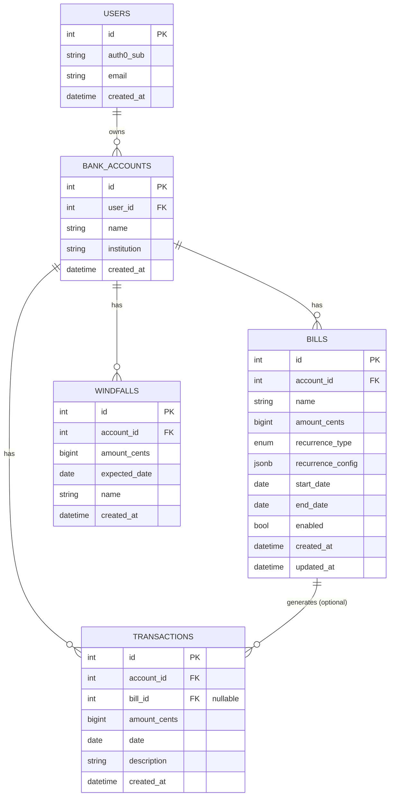

# Tally Roadmap

This is the living plan for building out Tally into a full bill-tracking and cash-flow
forecasting app. It's written to survive long gaps between sessions (~6 weeks apart,
~3 hours per session) — read this file first in any new session to see what's done and
what's next. Check off items as they land, and update the "Status" line at the top of
each phase.

This roadmap is now the planning source of truth. The original GitHub Project / bootstrap
issue set can be closed once each item is either reflected here, marked shipped, or called out
as superseded by the architecture decisions below.

## Vision

A multi-user bill-tracking and forecasting app, evolved from
[kenhowardpdx/bank](https://github.com/kenhowardpdx/bank) with:

1. Real authentication (Auth0)
2. Multiple bank accounts per user
3. Postgres (Neon) instead of local storage
4. A better UI, built in Svelte instead of React
5. Enable/disable control on individual bills
6. Finer-grained due-date interval control than "day of month" or "annual"
7. Ability to add one-off transactions within the current cycle
8. Ability to forecast a future windfall (bonus, tax refund, etc.)
9. Human-readable CSV import/export of all bills for a bank account, editable in Excel
   or Numbers, with amounts formatted in the selected display currency (default
   USD)

## What to reuse from `kenhowardpdx/bank`

The reference repo (cloned for research, not vendored) has real substance worth
porting rather than re-deriving from scratch:

- **`packages/forecast`** — a mature, tested cycle/due-date engine (`Bill`, `Cycle`,
  `Amount`, `getForecast`). Supports bi-weekly, monthly, semi-monthly ("10th & 25th"),
  and annual bills; computes which bills fall in a pay cycle and a running balance.
  Port the *logic*, not the code as-is — see Architecture Decisions below for the two
  changes to make while porting.
- **`apps/clientv0`** — the older, local-storage React UI (`Bills.tsx`, `Forecast.tsx`,
  `BillRow.tsx`). Not the codebase to reuse, but the *UX* is proven: an editable bill
  table, and a forecast table of pay-cycle rows (date range → running total, expandable
  to show which bills hit that cycle). Good starting point for the Svelte equivalent.
- **`apps/server` + `apps/client`** — a newer, partially-migrated Postgres + Auth0
  version. The migration to this architecture was never finished (bills CRUD/forecast
  UI never got ported over), but `AuthProvider.tsx` shows the working Auth0 SPA
  integration pattern, and `init.sql` shows a first-pass schema — both reference points
  for Tally's equivalents, not something to copy directly (Tally's schema goes further
  per the data model below).

## Architecture decisions

- **Data layer**: SQLAlchemy (async, via `asyncpg`) + Alembic migrations. More setup
  than raw SQL, but the schema lives in Python and migrations autogenerate — worth it
  across 6-week gaps where re-deriving the schema from scratch `.sql` files would cost
  real time.
- **Money**: integer cents (`amount_cents`, `BigInteger`) in Postgres, `Decimal` in
  Python — never float. The reference app's `Amount` class uses `parseFloat` on
  currency strings, a real precision bug worth not repeating. For UI and CSV
  import/export, format and parse amounts using the selected display currency
  (default USD) while persisting normalized cents.
- **Recurrence model**: an extended enum (`weekly`, `biweekly`, `semimonthly`,
  `monthly`, `annually`, `custom_days`) plus a small JSONB `recurrence_config` column
  for the type-specific bits (weekday, day-of-month, interval-in-days, etc.). Covers
  real-world bills without taking on full iCal RRULE complexity.
- **Auth**: Auth0. Backend validates JWTs via a FastAPI dependency (JWKS-based
  signature check, no session state). Frontend uses Auth0's SPA pattern (same shape as
  the reference app's `AuthProvider.tsx`, adapted for SvelteKit).
- **Local dev**: docker-compose Postgres for local development; Neon for prod (already
  provisioned — `TF_VAR_neon_org_id`/`NEON_API_KEY` exist in `.secrets`, but the actual
  database/schema isn't Terraform-managed yet, just manually created. Formalizing that
  is a Phase 0 task, not required before it).

## Data model

Implemented in `backend/src/models/` (SQLAlchemy 2.0, `Mapped`/`mapped_column` style) and
codified in the Alembic migration at `backend/alembic/versions/9f979f5fb842_initial_schema.py`.

Maps directly to the 8 differences: `users.auth0_sub` → auth; `bank_accounts` → multi-account;
whole schema → Postgres; `bills.enabled` → enable/disable; `recurrence_type`/`recurrence_config`
→ finer intervals; `transactions` → one-off entries; `windfalls` → future windfalls.

`recurrence_type` is a Postgres enum (`weekly`, `biweekly`, `semimonthly`, `monthly`, `annually`,
`custom_days`); `recurrence_config` holds the type-specific shape (e.g. `{"day_of_month": 15}`,
`{"days": [10, 25]}` for semimonthly, `{"interval_days": 45}` for custom_days) — validated by the
forecast engine in Phase 2, not by a DB constraint.

### Neon: manual vs. Terraform-managed (Phase 0.2 decision)

**Decision: keep the Neon project/database manual for now.** The connection strings already flow
into the Lambda's environment via `TF_VAR_database_url_readwrite`/`readonly` (see
`infra/variables.tf`), and Alembic now owns schema evolution independently of Terraform — so
bringing Neon itself under the Terraform Neon provider would manage project/branch creation but
wouldn't simplify anything currently painful. Revisit if/when multiple environments (e.g. a
per-PR preview branch) make manual Neon console clicks a recurring chore.

---

## Phase 0 — Foundations

**Status**: code complete; one follow-up item below (0.6)

- [x] 0.1 Finalize data model (turn the sketch above into real SQLAlchemy models + an ER
      diagram in this doc)
- [x] 0.2 Alembic setup + initial migration creating all tables; formalize the Neon
      database connection (confirm whether to bring it under Terraform via the Neon
      provider, or keep it manual — decide and document here)
- [x] 0.3 Local dev: docker-compose Postgres for backend dev, `.env` pattern mirroring
      prod's Neon connection shape
- [x] 0.4 Backend JWT validation dependency (`get_current_user`, `backend/src/core/auth.py`)
      + protected test endpoint (`GET /api/v1/me`), tested against a locally-signed RSA
      token so it doesn't depend on a real tenant existing yet. Auth0 tenant + API created;
      `AUTH0_DOMAIN`/`AUTH0_AUDIENCE` filled in `backend/.env` (see `backend/.env.example`).
- [x] 0.5 Auth0 frontend integration in SvelteKit (`frontend/src/lib/auth.ts`):
      login/logout, protected route pattern (`frontend/src/routes/(app)/+layout.svelte`),
      token attached to API calls (`frontend/src/lib/api.ts`). `PUBLIC_AUTH0_DOMAIN`/
      `PUBLIC_AUTH0_CLIENT_ID`/`PUBLIC_AUTH0_AUDIENCE` filled in `frontend/.env` (see
      `frontend/.env.example`), and the dev URL (`http://localhost:5173`) added as an
      Allowed Callback/Logout/Web Origin URL in the Auth0 SPA application settings.
- [ ] 0.6 Local dev auth bypass: an opt-in flag (env var, off by default) that skips real
      Auth0 token validation entirely and JIT-provisions a fixed dummy user, so
      `docker compose up` can be exercised end-to-end (including by an AI coding
      assistant in a sandboxed environment) without a real Auth0 login. Dummy identity
      themed as an It's Always Sunny in Philadelphia character, with an email-shaped
      display name - e.g. `charlie.kelly@paddys.bar` - close enough to a real Auth0
      `sub`/`email` claim pair that `get_current_db_user`'s JIT-provisioning path
      (`backend/src/api/deps.py`) needs no special-casing for it. Backend:
      short-circuit `get_current_user` (`backend/src/core/auth.py`) when the bypass flag
      is set, skipping the JWKS fetch/JWT decode entirely. Frontend: skip the Auth0 SPA
      redirect (`frontend/src/lib/auth.ts`) the same way, so login is instant locally.
      **Must never be reachable in prod** - gate behind an explicit env var checked at
      startup, never a request header/query param a client could set.

## Phase 1 — Accounts & Bills CRUD

**Status**: code complete; follow-up items below (1.7-1.8)

- [x] 1.1 Backend: `bank_accounts` CRUD API, scoped to the authenticated user
- [x] 1.2 Backend: `bills` CRUD API, scoped to an account, including the enable/disable
      toggle
- [x] 1.3 Frontend: accounts list/management page
- [x] 1.4 Frontend: bills list/management page per account (Svelte equivalent of
      `clientv0`'s `Bills.tsx` editable table UX)
- [x] 1.5 Bills page header always reads "Bills" regardless of which account you're on —
      should read `Bills (<Name> - <Bank>)`. Backend already exposes
      `GET /api/v1/accounts/{id}`; frontend just needs a `getAccount` call added to
      `frontend/src/lib/api/accounts.ts` and used in
      `frontend/src/routes/(app)/accounts/[id]/+page.svelte`.
- [x] 1.6 Move a bill to a different bank account. Backend: extend `BillUpdate`/
      `PATCH .../bills/{id}` (`backend/src/schemas/bill.py`, `backend/src/api/bills.py`) to
      accept a target `account_id`, verifying the target account also belongs to the
      current user (same ownership check pattern as `get_owned_bank_account`). Frontend: an
      pop-up modal where the user can select an account to move the bill to; once applied
      the bills list is updated to show the current list of bills sans the bill that was
      moved.
- [ ] 1.7 Recurrence-specific config UI for the bill form — **not yet designed, scope
      before starting**. Today `createBill` never sends `recurrence_config`
      (`frontend/src/routes/(app)/accounts/[id]/+page.svelte`), so every bill gets created
      with an empty `{}` regardless of type, even though the model needs type-specific data:
      `{"interval_days": N}` (custom_days), `{"days": [10, 25]}` (semimonthly),
      `{"day_of_month": N}` (monthly), and likely a weekday (weekly/biweekly) or month+day
      (annually). Needs per-type conditional form fields on both create and edit. Blocks
      exercising Phase 2's forecast engine end-to-end against real user-created bills of
      non-trivial recurrence types.
- [ ] 1.8 Bills CSV import/export per bank account. Backend: add account-scoped export and
      import endpoints for the full bills list, with validation/error reporting granular
      enough for a user-edited CSV. Frontend: add import/export actions on the bills page
      for the current account, with a downloadable template/example. CSV should stay
      human-readable and spreadsheet-friendly (Excel/Numbers), especially for money:
      amounts should be rendered and accepted in the selected display currency (default
      USD), while the backend continues storing normalized cents.

## Phase 2 — Forecast Engine

**Status**: code complete

- [x] 2.1 Port `Bill`/`Cycle`/`getForecast` to Python (`backend/src/forecast/`); no
      `Amount`/`Decimal` needed - `Bill.amount_cents` is already exact integer cents, so
      the whole engine is plain int arithmetic. Ported the bi-weekly/monthly golden-value
      test cases from `packages/forecast/src/__tests__/{cycle,forecast}.test.ts` directly
      (exact cents-converted parity); the semimonthly ("10th & 25th") cases were **not**
      ported as-is - the reference's day-bucket boundary for snapping onto the 10th/25th
      anchor is itself part of the `start`/`next` aliasing bug this port fixes rather than
      reproduces (day 21 snapped to the 25th in the reference, skipping the still-active
      10th-24th period), so those pin this engine's own corrected, self-verified output
      instead. See `backend/tests/test_forecast_engine.py`'s module docstring.
- [x] 2.2 Extended for weekly/semimonthly/custom_days per-bill recurrence (`RecurrenceType`,
      already modeled in Phase 1), plus a `weekly` *cycle* type the reference left as
      `throw new Error("NOT IMPLEMENTED")`. Also generalized beyond the reference's
      single-occurrence-per-cycle model: a weekly-recurring bill inside a monthly forecast
      cycle can genuinely recur more than once in that window, and now all occurrences
      count (see `test_weekly_bill_recurs_multiple_times_within_a_monthly_cycle`).
      Bills needing `recurrence_config` data that doesn't exist yet (semimonthly,
      custom_days - 1.7 was deferred) are skipped with a reason rather than guessed at or
      failing the whole request (`ForecastResponse.unscheduled_bills`).
- [x] 2.3 `POST /api/v1/accounts/{id}/forecast` (`backend/src/api/forecast.py`) - only
      `enabled` bills, scoped via the existing `get_owned_bank_account` pattern. Also
      persists the request's five params onto the account (`BankAccount.forecast_*`
      columns, new migration) as a side effect, so `GET .../accounts/{id}` returns the
      last-used settings - added after a plan review caught that the reference's
      client persisted these to `localforage` for exactly this reason (pay cycles are
      ~2 weeks apart; don't make the user re-enter the starting balance every visit).
- [x] 2.4 `frontend/src/routes/(app)/accounts/[id]/forecast/+page.svelte` - a separate
      route rather than the reference's same-page tab (fits SvelteKit's routing model
      better, keeps the bills page from growing further); form prefilled from the
      account's saved settings, explicit "Calculate" submit (a real API round-trip now,
      not the reference's free client-side recompute-on-keystroke); cycle rows expand
      in place to show bill line items, with the reference's red/gray
      negative/low-balance row coloring ported to Tailwind classes.

## Phase 3 — Transactions & Windfalls

**Status**: code complete

- [x] 3.1 Backend: one-off `transactions` CRUD (`backend/src/api/transactions.py`),
      folded into the forecast calculation alongside recurring bills
      (`backend/src/forecast/`). `Transaction.amount_cents` is **signed** (positive
      credits, negative debits) — unlike `Bill` (always a positive expense) or
      `Windfall` (always positive income), a one-off transaction is general-purpose.
      `Cycle`/`get_forecast` gained a combined `net_cents` per cycle
      (`transactions_total + windfalls_total - bills_total`); the tables already existed
      from Phase 0's initial migration, so no new migration was needed.
- [x] 3.2 Frontend: `/accounts/[id]/transactions` — list/create/delete, matching the
      bills page's original (pre-1.5/1.6) depth.
- [x] 3.3 Backend: `windfalls` CRUD (`backend/src/api/windfalls.py`), folded into
      forecast the same way — always a positive credit.
- [x] 3.4 Frontend: `/accounts/[id]/windfalls` entry UI; the forecast page's expanded
      cycle rows now also list transaction and windfall line items alongside bills,
      windfalls visually distinguished with a badge (the one thing in a forecast that's
      unambiguously good news). Added a shared `AccountNav` component
      (`frontend/src/lib/components/AccountNav.svelte`) across all four per-account pages
      (Bills/Transactions/Windfalls/Forecast) — the old one-off "← Accounts"/"Forecast →"
      links didn't scale past two sibling pages.

## Phase 4 — Multi-account dashboard & polish

**Status**: not started

- [ ] 4.1 Dashboard aggregating all of a user's accounts (combined + per-account views).
      Per account, a "current cycle" snapshot card: the pay cycle containing today (date
      range, bills due, running balance) at a glance, linking through to the full forecast
      page for that account. Reuses the forecast engine (`backend/src/forecast/`) rather
      than new logic - the open question is how to correctly identify "the cycle
      containing today" for cycle types that don't self-anchor (weekly/biweekly/monthly
      only snap to whatever `start_date` a request gives them, unlike semimonthly's fixed
      10th/25th boundaries - see `engine.py`'s `_cycle_bounds`), starting from the
      account's saved `forecast_start_date`/`forecast_cycle_type`
      (`BankAccount.forecast_*`, persisted since Phase 2.3) and stepping forward/backward
      to the cycle that actually contains today, rather than naively calling
      `get_forecast(start_date=today, end_date=today, ...)` (which would anchor a new
      cycle AT today instead of finding the in-progress one).
- [ ] 4.2 UI/design pass — consistent Svelte component system, responsive layout. Still open:
      general responsive layout pass, plus whatever else turns up. Done so far:
      - [x] a real date-picker component (`frontend/src/lib/components/DatePicker.svelte`,
        a popover calendar) replacing the native `<input type="date">` in the bill form
      - [x] a `Select` component styled to match `Input`
        (`frontend/src/lib/components/Select.svelte`), used for the bill form's Frequency
        field and the move-bill account picker
      - [x] renamed the "Recurrence" label to "Frequency" in the bill form
      - [x] human-readable labels for recurrence values (`frontend/src/lib/recurrence.ts`),
        used in both the dropdown and the bills table
- [ ] 4.3 Error handling, loading states, empty states throughout
- [ ] 4.4 Test coverage: forecast engine (pytest), key frontend components
- [ ] 4.5 In-app help: a glossary/definitions page explaining Tally-specific terms (Cycle
      Type, Frequency, Windfall, the semimonthly 10th/25th convention, etc. — the concepts
      this app introduces that aren't self-explanatory from the UI alone), plus contextual
      tooltips on the fields that use this vocabulary (the bill form's Frequency select,
      the forecast form's Cycle select, the windfall form) so users get the definition in
      the moment instead of leaving the page to look it up. No tooltip component exists
      yet (`frontend/src/lib/components/`) — needs a small reusable one, hover/focus
      triggered and keyboard accessible.
- [ ] 4.6 Logged-out homepage: replace the current placeholder root page
      (`frontend/src/routes/+page.svelte`, currently just a couple of sentences before
      redirecting authenticated users to `/accounts`) with real marketing content — what
      Tally is, why to sign up — plus an interactive demo: a pre-selected sample list of
      bills the visitor can add to (and remove from) and immediately see the effect on a
      forecast, no login required. Needs a public, unauthenticated forecast endpoint that
      reuses `backend/src/forecast/get_forecast` directly against demo data in the request
      (no DB writes, no account, no auth) rather than reimplementing the engine in JS for
      the demo — keeps the demo's math guaranteed identical to the real product's.

## Phase 5 — Production hardening (ongoing, lower priority)

- [ ] Structured logging / basic observability within free-tier limits (#19)
- [ ] Confirm Neon's backup/retention behavior meets expectations, plus a documented
      restore drill / disaster-recovery path (#20)
- [ ] Periodic cost review (matches CLAUDE.md's cost-first philosophy)
- [ ] Security hardening review for IAM/Auth0/API/storage settings, keeping the current
      cost-first architecture in mind (#21)
- [ ] Production deployment audit: reconcile the older infra/bootstrap issues with the
      current Terraform + GitHub Actions reality, document what is already live, and split
      any remaining gaps into smaller concrete follow-ups (#8, #9, #10, #12, #17, #18)
- [ ] DNS/domain decision: either move DNS to Route 53 and cut over from Hover, or
      explicitly keep DNS outside AWS and document the manual process/rollback (#13, #14)
- [ ] End-to-end production verification across Auth0, CloudFront, API Gateway, Lambda,
      and Neon (#22)
- [ ] System / ops / API documentation pass, including deployment/runbook coverage (#23)

## Legacy GitHub Project issue crosswalk

Use this when closing the old project-management issues so their intent stays visible here:

- **Already shipped and represented above**
  - #6 → Phase 0.1-0.2
  - #7 → Phase 0.4, 1.1, 1.2
  - #11 → Phase 0.5, 1.3, 1.4, 4.2
  - #15, #16 → Phase 0.4-0.5
- **Superseded in original form**
  - #8 assumed VPC/private-subnet + Secrets Manager plumbing. The current cost-first
    design instead keeps Lambda out of a VPC and passes Auth0/Neon values as Terraform
    variables/environment config; track any remaining deployment hardening under Phase 5.
- **Still relevant, now consolidated into roadmap items above**
  - #9, #10, #12, #17, #18 → Phase 5 production deployment audit
  - #13, #14 → Phase 5 DNS/domain decision
  - #19 → Phase 5 observability
  - #20 → Phase 5 backup / disaster recovery
  - #21 → Phase 5 security hardening review
  - #22 → Phase 5 end-to-end production verification
  - #23 → Phase 5 documentation pass

---

## Session log

Keep this brief — one line per session, what shipped, what's next. Helps a fresh
session (or a fresh Claude Code instance) orient in under a minute.

- 2026-07-10: Roadmap created. No app code yet — `backend/` and `frontend/` are both
  bare scaffolds (from the earlier prod-outage recovery work). Next: Phase 0.1.
- 2026-07-10: Phase 0 built out end-to-end: SQLAlchemy models + ER diagram (0.1), Alembic
  wired up with a verified initial migration — upgrade/downgrade round-trip tested against
  real Postgres, including a fix for the Postgres-enum-survives-drop-table gotcha (0.2),
  docker-compose Postgres for local dev on host port 5433 (5432 was taken by an unrelated
  `bank` project container) (0.3), JWT validation dependency + `GET /api/v1/me` tested with
  a locally-signed RSA token (0.4), and SvelteKit Auth0 SPA integration — login/logout,
  protected `/dashboard` route, token-attaching `apiFetch` helper, verified via
  `svelte-check` and a full static build (0.5). **Not done**: the actual Auth0 tenant/API
  doesn't exist yet — that's a manual console step (see 0.4/0.5 notes above) before the
  frontend↔backend auth flow can be exercised for real. Next: create the Auth0 tenant, then
  start Phase 1 (accounts & bills CRUD).
- 2026-07-11: Phase 1 shipped and merged (PR #82) — Auth0 tenant created and verified via a
  real login; backend accounts/bills CRUD with JIT user provisioning; frontend Tailwind +
  accounts/bills pages behind an auth-guarded route group; whole stack now runs via
  `docker compose up`; docs/READMEs/`.example` files reconciled with reality. Follow-ups
  logged rather than fixed this session: bills page header doesn't show the account
  name/bank (1.5), no way to move a bill between accounts (1.6), and the native date picker
  needs replacing (folded into 4.2). Next: pick up Phase 1.5/1.6, or start Phase 2
  (forecast engine).
- 2026-07-11: Picked up 1.5, 1.6, and part of 4.2. Bills page header now shows
  `Bills (<Name> - <Bank>)`; bills can be moved between accounts via a modal (backend
  ownership-checks the target account); new `Select`, `Modal`, and `DatePicker` (custom
  popover calendar, no new dependency) components; "Recurrence" renamed to "Frequency" with
  human-readable value labels everywhere. Left 1.7 alone (recurrence-config UI) per its own
  "not yet designed" flag. Next: scope 1.7, or start Phase 2.
- 2026-07-12: Roadmap expanded with a new bills CSV import/export follow-up (1.8): per
  account, human-readable spreadsheet-friendly CSVs, with amounts formatted and parsed in the
  selected display currency (default USD), while storage remains normalized cents. Next: decide when
  to slot 1.8 relative to 1.7 vs. Phase 2.
- 2026-07-12: Phase 2 (forecast engine) shipped — ported the reference `kenhowardpdx/bank`
  engine to `backend/src/forecast/`, extended for Tally's full recurrence model, and added
  the `POST .../forecast` endpoint + `/accounts/[id]/forecast` Svelte page. Persisted
  forecast settings onto `BankAccount` (new columns/migration) after catching mid-plan that
  the reference persists these client-side for a real reason (~2-week pay cycles, don't
  re-enter the starting balance every visit) — worth remembering for future phases: check
  whether "ephemeral request params" in a reference implementation are actually ephemeral,
  or just persisted somewhere this port doesn't have yet. 1.7 (recurrence-config UI) is
  still open and still blocks semimonthly/custom_days bills from being real (they show up
  as "unscheduled" in any forecast). Next: 1.7, or Phase 3 (transactions & windfalls).
- 2026-07-12: Phase 3 (transactions & windfalls) shipped — both CRUD'd
  (`backend/src/api/{transactions,windfalls}.py`) and folded into the forecast engine via
  a new per-cycle `net_cents` (transactions signed, windfalls always positive, bills
  always subtracted); new `/accounts/[id]/{transactions,windfalls}` pages, and a shared
  `AccountNav` component across all four per-account pages now that there are four
  siblings instead of two. Tables already existed from Phase 0, so no new migration.
  Also logged four follow-up items to the roadmap this session: 0.6 (local dev Auth0
  bypass, It's Always Sunny themed dummy user), 4.1's dashboard now specs a per-account
  "current cycle" snapshot card, 4.5 (in-app glossary + field tooltips for
  Tally-specific vocabulary), and 4.6 (a real logged-out homepage with an interactive,
  no-login forecast demo reusing the real engine via a new public endpoint). Next: 1.7,
  Phase 4, or any of the newly-logged follow-ups.
