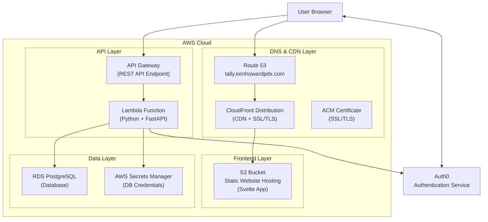

# Tally Infrastructure

This directory contains the Terraform infrastructure as code for deploying Tally to AWS. The infrastructure uses a modular approach with AWS SSO authentication and automated credential management.

## Architecture Overview



## Prerequisites

### Required Tools

- **AWS CLI v2**: [Installation Guide](https://docs.aws.amazon.com/cli/latest/userguide/getting-started-install.html)
- **Terraform >= 1.0**: [Installation Guide](https://terraform.io/downloads)
- **Make**: Usually pre-installed on macOS/Linux

### AWS Account Setup

1. **AWS SSO Access**: You need access to AWS account `123456789012` with the `AdministratorAccess` role
2. **S3 State Bucket**: The Terraform state is stored in `terraform-state-123456789012`

## Quick Start

### 1. Initial Setup

```sh
# Navigate to infrastructure directory
cd infra

# Complete development setup (checks tools, sets up AWS, initializes Terraform)
make dev-setup
```

### 2. Infrastructure Management

```sh
# Plan infrastructure changes
make plan

# Apply changes (with confirmation prompt)
make apply

# View current state
make show

# Destroy infrastructure (with confirmation prompt)
make destroy
```

## Makefile Commands

### Core Commands

| Command          | Description                              |
| ---------------- | ---------------------------------------- |
| `make help`      | Show all available commands              |
| `make dev-setup` | Complete development environment setup   |
| `make plan`      | Create and show Terraform execution plan |
| `make apply`     | Apply Terraform configuration            |
| `make destroy`   | Destroy all managed infrastructure       |

### AWS Credential Management

| Command                  | Description                               |
| ------------------------ | ----------------------------------------- |
| `make aws-setup`         | Configure AWS SSO credentials (automatic) |
| `make check-aws`         | Verify AWS credentials are valid          |
| `make clean-credentials` | Remove cached credentials (force re-auth) |

### Utility Commands

| Command               | Description                      |
| --------------------- | -------------------------------- |
| `make validate`       | Validate Terraform configuration |
| `make fmt`            | Format Terraform files           |
| `make clean`          | Clean Terraform cache            |
| `make state-list`     | List resources in state          |
| `make workspace-list` | List Terraform workspaces        |

## AWS Credential Management

The Makefile includes intelligent AWS credential management:

### Automatic Features

- **Smart Detection**: Checks if credentials exist and are valid
- **Auto-Authentication**: Runs AWS SSO login only when needed
- **Credential Caching**: Stores credentials in `.aws-credentials` file
- **Expiration Handling**: Automatically refreshes expired credentials
- **Secure Storage**: Credentials file is excluded from git

### Manual Credential Management

If you need to manually manage credentials:

```sh
# Source the setup script directly (must be sourced, not executed)
source ../scripts/setup-aws.sh

# Or use the Makefile command
make aws-setup

# Clear cached credentials to force re-authentication
make clean-credentials
```

## Infrastructure Modules

The infrastructure is organized into reusable modules:

### Available Modules

- **`lambda`**: Backend API (Python FastAPI)
- **`api_gateway`**: HTTP API endpoints and routing
- **`acm`**: SSL/TLS certificates
- **`route53`**: DNS and domain management
- **`auth0`**: Authentication integration

### Module Status

Currently, all modules are commented out in `main.tf` as placeholders. Uncomment and configure modules as you implement each component:

```hcl
# In main.tf, uncomment when ready to implement:
# module "lambda" {
#   source = "./modules/lambda"
#   # Add lambda module variables here
# }
```

## Development Workflow

### Implementing New Infrastructure

1. **Implement a module** (e.g., `modules/lambda/main.tf`)
2. **Uncomment the module** in `main.tf`
3. **Add required variables** and outputs
4. **Plan and apply** changes:
   ```sh
   make plan
   make apply
   ```

### Recommended Implementation Order

1. **Lambda**: Core backend functionality
2. **API Gateway**: HTTP endpoints
3. **ACM**: SSL certificates
4. **Route53**: DNS configuration
5. **Auth0**: Authentication (optional for MVP)

## Configuration Files

| File                   | Purpose                              |
| ---------------------- | ------------------------------------ |
| `main.tf`              | Main Terraform configuration         |
| `variables_outputs.tf` | Input variables and outputs          |
| `Makefile`             | Build automation and AWS integration |
| `.aws-credentials`     | Cached AWS credentials (git-ignored) |
| `modules/*/`           | Reusable infrastructure modules      |

## Environment Management

### Workspaces

Use Terraform workspaces for different environments:

```sh
# Create new environment
make workspace-new NAME=staging

# Switch environments
make workspace-select NAME=production

# List environments
make workspace-list
```

### State Management

- **Remote State**: Stored in S3 bucket `terraform-state-123456789012`
- **State Locking**: Handled automatically by S3 backend
- **Encryption**: State is encrypted at rest

## Troubleshooting

### Common Issues

**AWS Credentials Not Working**

```sh
# Clear cached credentials and re-authenticate
make clean-credentials
make aws-setup
```

**Terraform Init Fails**

```sh
# Clean Terraform cache and reinitialize
make clean
make init
```

**Module Validation Errors**

- Ensure modules are properly implemented before uncommenting in `main.tf`
- Check that all required arguments are provided

### Getting Help

```sh
# Show all available commands
make help

# Validate configuration without applying
make validate

# Check AWS credentials
make check-aws
```

## Security Considerations

- **Credentials**: Never commit `.aws-credentials` file (included in `.gitignore`)
- **State Files**: Remote state is encrypted and access-controlled
- **IAM**: Uses least-privilege access patterns
- **Secrets**: Sensitive data stored in AWS Secrets Manager

## Contributing

1. **Test locally** with `make plan` before applying changes
2. **Validate configuration** with `make validate`
3. **Format code** with `make fmt`
4. **Document changes** in commit messages

For questions or issues, see the main [project README](../README.md) or open an issue.
