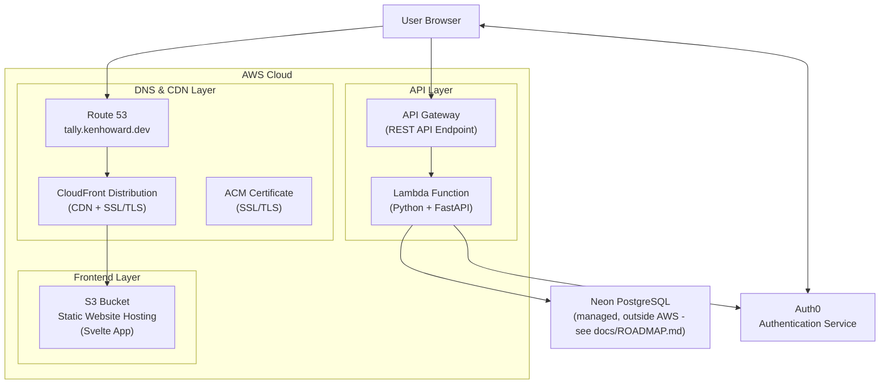

# Tally Infrastructure

This directory contains the Terraform infrastructure as code for deploying Tally to AWS. The infrastructure uses a modular approach with AWS SSO authentication and automated credential management.

## Architecture Overview


```mermaid
graph TB
    subgraph AWS["AWS Cloud"]
        subgraph DNS["DNS & CDN Layer"]
            R53["Route 53<br/>tally.kenhoward.dev"]
            CF["CloudFront Distribution<br/>(CDN + SSL/TLS)"]
            ACM["ACM Certificate<br/>(SSL/TLS)"]
        end

        subgraph Frontend["Frontend Layer"]
            S3["S3 Bucket<br/>Static Website Hosting<br/>(Svelte App)"]
        end

        subgraph API["API Layer"]
            APIGW["API Gateway<br/>(REST API Endpoint)"]
            Lambda["Lambda Function<br/>(Python + FastAPI)"]
        end

    end

    Neon["Neon PostgreSQL<br/>(managed, outside AWS - see docs/ROADMAP.md)"]
    User["User Browser"]
    Auth0["Auth0<br/>Authentication Service"]

    User --> R53
    User <--> Auth0
    R53 --> CF
    CF --> S3
    User --> APIGW
    APIGW --> Lambda
    Lambda --> Auth0
    Lambda --> Neon
```

Connection strings and Auth0 values reach the Lambda as plain environment variables
(`TF_VAR_database_url_readwrite`/`readonly`, `TF_VAR_auth0_domain`/`audience` — see
`modules/lambda/main.tf`), not AWS Secrets Manager.

## Prerequisites

### Required Tools

- **AWS CLI v2**: [Installation Guide](https://docs.aws.amazon.com/cli/latest/userguide/getting-started-install.html)
- **Terraform >= 1.0**: [Installation Guide](https://terraform.io/downloads)
- **Make**: Usually pre-installed on macOS/Linux

### AWS Account Setup

1. **AWS SSO Access**: You need access to your AWS account with the `AdministratorAccess` role
2. **S3 State Bucket**: Create an S3 bucket for Terraform state storage: `terraform-state-YOUR_ACCOUNT_ID`
3. **Configuration**: Copy and configure the example files with your account details

## Quick Start

### 1. Initial Setup

```sh
# Navigate to infrastructure directory
cd infra

# Configure your AWS account details
cp terraform.tfvars.example terraform.tfvars
cp backend.conf.example backend.conf

# Edit these files with your actual AWS account ID and profile name
# vim terraform.tfvars
# vim backend.conf

# Complete development setup (checks tools, sets up AWS, initializes Terraform)
make dev-setup
```

### 2. Infrastructure Management

```sh
# Plan infrastructure changes
make plan

# Apply changes (with confirmation prompt)
make apply

# View current state
make show

# Destroy infrastructure (with confirmation prompt)
make destroy
```

## Makefile Commands

### Core Commands

| Command          | Description                              |
| ---------------- | ---------------------------------------- |
| `make help`      | Show all available commands              |
| `make dev-setup` | Complete development environment setup   |
| `make plan`      | Create and show Terraform execution plan |
| `make apply`     | Apply Terraform configuration            |
| `make destroy`   | Destroy all managed infrastructure       |

### AWS Credential Management

| Command          | Description                                       |
| ---------------- | ------------------------------------------------- |
| `make aws-login` | SSO login (for direct terraform use)              |
| `make aws-creds` | SSO login + export STS credentials (for ACT)      |
| `make check-aws` | Verify AWS credentials are valid                  |

### Utility Commands

| Command               | Description                      |
| --------------------- | -------------------------------- |
| `make validate`       | Validate Terraform configuration |
| `make fmt`            | Format Terraform files           |
| `make clean`          | Clean Terraform cache            |
| `make state-list`     | List resources in state          |
| `make workspace-list` | List Terraform workspaces        |

## AWS Credential Management

Auth is handled by `scripts/aws-auth.sh` via two Makefile targets:

- **`make aws-login`** — SSO login only. Use this before running `terraform plan` or any direct terraform commands. Terraform reads the SSO session via `AWS_PROFILE` — no credential export needed.
- **`make aws-creds`** — SSO login + exports static STS credentials to `~/.aws/credentials` and updates the credential vars in `.secrets`. Use this before running ACT workflows, since containers can't use SSO.

Credentials expire after ~8 hours. Re-run the appropriate target when they do.

## Infrastructure Modules

The infrastructure is organized into reusable modules:

### Available Modules

- **`lambda`**: Backend API (Python FastAPI)
- **`api_gateway`**: REST API endpoint routing to the Lambda
- **`backend_s3`**: S3 bucket for Lambda deployment artifacts
- **`frontend_s3`**: S3 bucket for the static frontend build
- **`cloudfront`**: CDN in front of `frontend_s3`, proxying `/api/v1/*` to `api_gateway`
- **`acm`**: SSL/TLS certificate for the CloudFront custom domain
- **`auth0`**: placeholder — the Auth0 tenant/API/SPA app are created manually in the Auth0
  dashboard, not via Terraform (this module currently has no resources)

### Module Status

All modules above except `auth0` are implemented and wired up in `main.tf`. Two stub blocks
remain commented out at the bottom of `main.tf` (a duplicate `acm` and an `auth0` module call)
— safe to ignore or clean up, not part of the active configuration.

## Development Workflow

### Implementing New Infrastructure

1. **Implement a module** (e.g., `modules/lambda/main.tf`)
2. **Uncomment the module** in `main.tf`
3. **Add required variables** and outputs
4. **Plan and apply** changes:
   ```sh
   make plan
   make apply
   ```

### Recommended Implementation Order

1. **Lambda**: Core backend functionality
2. **API Gateway**: HTTP endpoints
3. **ACM**: SSL certificates
4. **Route53**: DNS configuration
5. **Auth0**: Authentication (optional for MVP)

## Configuration Files

| File                   | Purpose                                                    |
| ---------------------- | ---------------------------------------------------------- |
| `main.tf`              | Main Terraform configuration                               |
| `variables_outputs.tf` | Input variables and outputs                                |
| `Makefile`             | Build automation and AWS integration                       |
| `.aws-credentials`     | Cached AWS credentials (git-ignored)                       |
| `modules/*/`           | Reusable infrastructure modules                            |
| `backend.conf.json`    | S3 backend config for Terraform state (used only in CI/CD) |

### S3 Backend Configuration (backend.conf.json)

`backend.conf.json` contains the S3 backend configuration for storing Terraform state remotely in CI/CD workflows. This file is **not used for local/ACT runs**—local runs use a local backend to avoid S3 charges and simplify development.

**Example contents:**

```json
{
  "bucket": "terraform-state-<aws_account_id>",
  "key": "tally/prod/terraform.tfstate",
  "region": "us-west-2",
  "encrypt": true
}
```

**Usage:**

- CI/CD workflows copy this file to `backend.conf` and run `terraform init -backend-config=backend.conf`.
- For local/ACT runs, use `make init-local` to initialize with a local backend.

See `docs/DEVELOPING.md` for more on backend switching and workflow logic.

## Environment Management

### Workspaces

Use Terraform workspaces for different environments:

```sh
# Create new environment
make workspace-new NAME=staging

# Switch environments
make workspace-select NAME=production

# List environments
make workspace-list
```

### State Management

- **Remote State**: Stored in S3 bucket `terraform-state-YOUR_ACCOUNT_ID` (configured in backend.conf)
- **State Locking**: Handled automatically by S3 backend
- **Encryption**: State is encrypted at rest

## Troubleshooting

### Common Issues

**AWS Credentials Not Working**

```sh
# Re-authenticate (for direct terraform)
make aws-login

# Or, if running ACT workflows
make aws-creds
```

**Terraform Init Fails**

```sh
# Clean Terraform cache and reinitialize
make clean
make init
```

**Module Validation Errors**

- Ensure modules are properly implemented before uncommenting in `main.tf`
- Check that all required arguments are provided

### Getting Help

```sh
# Show all available commands
make help

# Validate configuration without applying
make validate

# Check AWS credentials
make check-aws
```

## Security Considerations

- **Credentials**: Never commit `.aws-credentials` file (included in `.gitignore`)
- **State Files**: Remote state is encrypted and access-controlled
- **IAM**: Uses least-privilege access patterns
- **Secrets**: Sensitive data stored in AWS Secrets Manager

## Contributing

1. **Test locally** with `make plan` before applying changes
2. **Validate configuration** with `make validate`
3. **Format code** with `make fmt`
4. **Document changes** in commit messages

For questions or issues, see the main [project README](../README.md) or open an issue.
