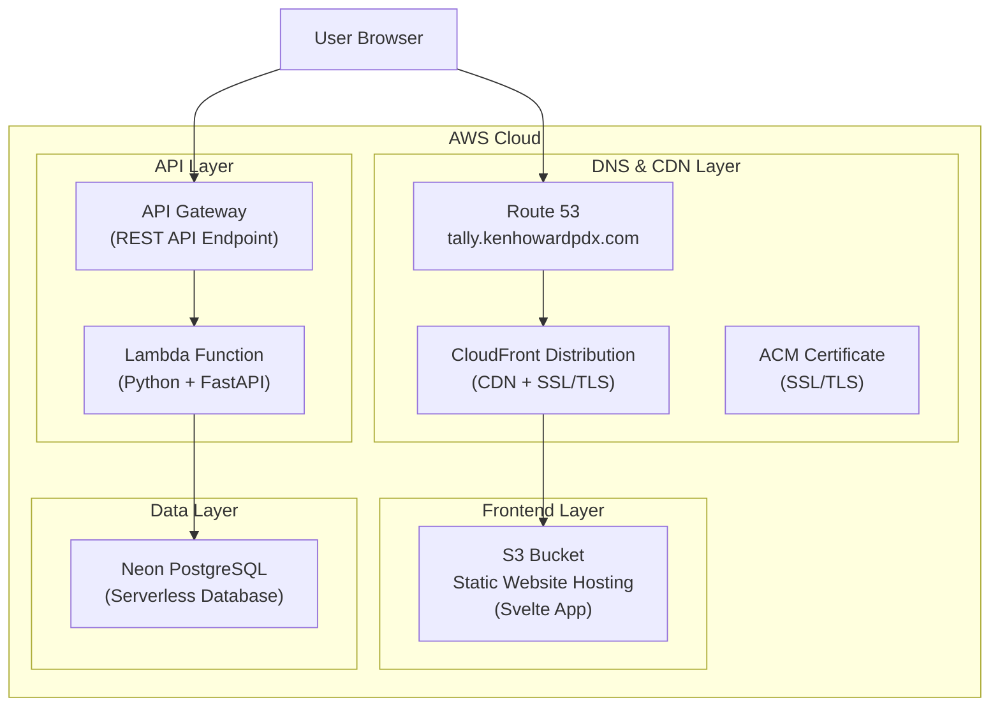

# Tally Infrastructure

This directory contains the Terraform infrastructure as code for deploying Tally to AWS. The infrastructure uses a modular approach with workspace-based environment isolation.

## Workspace Strategy

**Two completely separate environments using Terraform workspaces:**

### Production (default workspace)

- **Workspace**: `default`
- **Environment**: `TF_VAR_environment=prod`
- **Deployment**: GitHub Actions (automated on push to main)
- **Custom domain**: `tally.kenhoward.dev`
- **API stage**: `/prod`
- **Neon branch**: `production`

### Development (local-dev workspace)

- **Workspace**: `local-dev`
- **Environment**: `TF_VAR_environment=dev`
- **Deployment**: Local machine via `make local-*` commands
- **Domain**: Auto-generated CloudFront domain
- **API stage**: `/dev`
- **Neon branch**: `development`

**Key differences:**

- Each workspace creates **separate infrastructure** (different Lambda, API Gateway, CloudFront, etc.)
- Shared Neon project (`example-project-12345678`) but **different branches** per environment
- Production includes ACM certificate and Route53 DNS (dev does not)
- Both use the same S3 backend but different state files

## Architecture Overview


```mermaid
graph TB
    subgraph AWS["AWS Cloud"]
        subgraph DNS["DNS & CDN Layer"]
            R53["Route 53<br/>tally.kenhowardpdx.com"]
            CF["CloudFront Distribution<br/>(CDN + SSL/TLS)"]
            ACM["ACM Certificate<br/>(SSL/TLS)"]
        end

        subgraph Frontend["Frontend Layer"]
            S3["S3 Bucket<br/>Static Website Hosting<br/>(Svelte App)"]
        end

        subgraph API["API Layer"]
            APIGW["API Gateway<br/>(REST API Endpoint)"]
            Lambda["Lambda Function<br/>(Python + FastAPI)"]
        end

        subgraph Data["Data Layer"]
            Neon["Neon PostgreSQL<br/>(Serverless Database)"]
        end
    end

    User["User Browser"]

    User --> R53
    R53 --> CF
    CF --> S3
    User --> APIGW
    APIGW --> Lambda
    Lambda --> Neon
```

## Prerequisites

### Required Tools

- **AWS CLI v2**: [Installation Guide](https://docs.aws.amazon.com/cli/latest/userguide/getting-started-install.html)
- **Terraform >= 1.0**: [Installation Guide](https://terraform.io/downloads)
- **Make**: Usually pre-installed on macOS/Linux

### AWS Account Setup

1. **AWS SSO Access**: You need access to your AWS account with the `AdministratorAccess` role
2. **S3 State Bucket**: Create an S3 bucket for Terraform state storage: `terraform-state-YOUR_ACCOUNT_ID`
3. **Configuration**: Copy and configure the example files with your account details

## Quick Start

### 1. Initial Setup

````sh
## Local Development Quick Start

**Recommended approach for testing infrastructure changes:**

```sh
# Navigate to infrastructure directory
cd infra

# Configure local secrets (one time setup)
cp ../.secrets.example ../.secrets
# Edit ../.secrets with your AWS_PROFILE, account ID, and Neon credentials

# Initialize local-dev workspace
make local-init

# Plan infrastructure changes
make local-plan

# Apply changes to local-dev environment
make local-apply

# Destroy local-dev infrastructure when done
make local-destroy
````

## Makefile Commands

### Local Development (Recommended)

| Command               | Description                                                |
| --------------------- | ---------------------------------------------------------- |
| `make local-init`     | Initialize Terraform with S3 backend + local-dev workspace |
| `make local-plan`     | Plan infrastructure changes in local-dev                   |
| `make local-apply`    | Apply changes to local-dev environment                     |
| `make local-destroy`  | Destroy all local-dev infrastructure                       |
| `make local-fmt`      | Format all Terraform files                                 |
| `make local-validate` | Validate Terraform configuration                           |

### Terraform State Management

| Command                           | Description                           |
| --------------------------------- | ------------------------------------- |
| `make state-list`                 | List all resources in Terraform state |
| `make state-show RESOURCE=<name>` | Show details of specific resource     |
| `make workspace-list`             | List all Terraform workspaces         |
| `make workspace-show`             | Show current workspace                |

### Cleanup Commands

| Command                | Description                                            |
| ---------------------- | ------------------------------------------------------ |
| `make clean-terraform` | Remove .terraform, lock files (safe reset)             |
| `make clean-state`     | Remove local state files (WARNING: local backend only) |
| `make clean-all`       | Remove all Terraform files (requires confirmation)     |

### GitHub Actions Testing (ACT)

| Command          | Description                                                  |
| ---------------- | ------------------------------------------------------------ |
| `make act-plan`  | Test terraform-pr workflow locally with ACT                  |
| `make act-apply` | Test terraform-apply workflow locally with ACT (use caution) |

## Local Development Workflow

The local development setup uses the `scripts/tf-local` wrapper script which handles:

- **AWS SSO Authentication**: Automatic session validation and credential export
- **Workspace Isolation**: Forces `local-dev` workspace to prevent prod accidents
- **Environment Variables**: Preserves NEON_API_KEY and project variables
- **Credential Management**: Unsets temporary AWS credentials, exports SSO credentials

### Common Commands

```sh
# See what infrastructure would be created
make local-plan

# Apply changes to local-dev environment
make local-apply

# Check current workspace (should show: local-dev)
make workspace-show

# List all deployed resources
make state-list

# Show details of a specific resource
make state-show RESOURCE=module.lambda.aws_lambda_function.backend

# Format Terraform files
make local-fmt

# Destroy everything in local-dev (start fresh)
make local-destroy
```

### Cleanup and Recovery

```sh
# If Terraform gets stuck or confused
make clean-terraform  # Removes .terraform directory
make local-init       # Reinitialize

# Remove all local Terraform files (nuclear option)
make clean-all

# If you accidentally switch workspaces
../scripts/tf-local workspace select local-dev
```

## Infrastructure Modules

The infrastructure is organized into reusable modules:

### Core Modules (Always Deployed)

- **`vpc`**: Network infrastructure (VPC, subnets, security groups)
- **`lambda`**: Backend API function (Python)
- **`api_gateway`**: REST API endpoints and routing
- **`cloudfront`**: CDN for frontend and API
- **`frontend_s3`**: Static website hosting for Svelte frontend
- **`backend_s3`**: Lambda deployment artifacts storage
- **`neon`**: Serverless PostgreSQL database (multi-branch per environment)

### Production-Only Modules (Conditional)

- **`acm`**: SSL/TLS certificates for CloudFront custom domain
- **`route53`**: DNS management for tally.kenhoward.dev

## Local Development Workflow

| ---------------------- | ---------------------------------------------------------- |
| `main.tf` | Main Terraform configuration |
| `variables_outputs.tf` | Input variables and outputs |
| `Makefile` | Build automation and AWS integration |
| `.aws-credentials` | Cached AWS credentials (git-ignored) |
| `modules/*/` | Reusable infrastructure modules |
| `backend.conf.json` | S3 backend config for Terraform state (used only in CI/CD) |

### S3 Backend Configuration (backend.conf.json)

`backend.conf.json` contains the S3 backend configuration for storing Terraform state remotely in CI/CD workflows. This file is **not used for local/ACT runs**—local runs use a local backend to avoid S3 charges and simplify development.

**Example contents:**

```json
{
  "bucket": "terraform-state-<aws_account_id>",
  "key": "tally/prod/terraform.tfstate",
  "region": "us-west-2",
  "encrypt": true
}
```

**Usage:**

- CI/CD workflows copy this file to `backend.conf` and run `terraform init -backend-config=backend.conf`.
- For local/ACT runs, use `make init-local` to initialize with a local backend.

See `docs/DEVELOPING.md` for more on backend switching and workflow logic.

## Environment Management

### Workspaces

Use Terraform workspaces for different environments:

```sh
# Create new environment
make workspace-new NAME=staging

# Switch environments
make workspace-select NAME=production

# List environments
make workspace-list
```

### State Management

- **Remote State**: Stored in S3 bucket `terraform-state-YOUR_ACCOUNT_ID` (configured in backend.conf)
- **State Locking**: Handled automatically by S3 backend
- **Encryption**: State is encrypted at rest

## Troubleshooting

### Common Issues

**AWS Credentials Not Working**

```sh
# Clear cached credentials and re-authenticate
make clean-credentials
make aws-setup
```

**Terraform Init Fails**

```sh
# Clean Terraform cache and reinitialize
make clean
make init
```

**Module Validation Errors**

- Ensure modules are properly implemented before uncommenting in `main.tf`
- Check that all required arguments are provided

### Getting Help

```sh
# Show all available commands
make help

# Validate configuration without applying
make validate

# Check AWS credentials
make check-aws
```

## Security Considerations

- **Credentials**: Never commit `.aws-credentials` file (included in `.gitignore`)
- **State Files**: Remote state is encrypted and access-controlled
- **IAM**: Uses least-privilege access patterns
- **Secrets**: Sensitive data stored in AWS Secrets Manager

## Contributing

1. **Test locally** with `make plan` before applying changes
2. **Validate configuration** with `make validate`
3. **Format code** with `make fmt`
4. **Document changes** in commit messages

For questions or issues, see the main [project README](../README.md) or open an issue.
